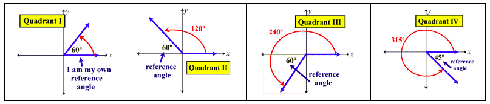

# `Reference Angle`
> The notion `reference angle` would be the **very FIRST thing** to understand before solving any trig equations.

First thing first, it's always the angel with `X-axis` and `Terminal Ray`.

What is it for:
In trigonometry, if angles have the same `reference angle`, then they do have the **SAME** trig function values.
e.g. `sin(x) = sin(π-x)`, 
`cos(x) = cos(2π-x)`.

[Math bits notebook.](https://mathbitsnotebook.com/Algebra2/TrigConcepts/TCStandardPosition.html)
[Math open reference.](https://www.mathopenref.com/reference-angle.html)

Features of a `reference angle`:
- It's always **LESS THAN** 90°.
- It's always **POSITIVE**.
- It's always the angle between the Side and the **X-axis**.

How to get the reference angle  θ:
- Quadrant I:  `θ`
- Quadrant II: `π - θ`
- Quadrant III: `θ - π`
- Quadrant IV: `2π - θ`

## `Angles in Standard Position`
> Regard to the `reference angle`, the `angles in standard position` means the ORIGINAL angle.

e.g. There's an angle `θ = 330°`. So `330°` is the `angle in standard position`, and `30°` is its `reference angle`.

Tricks:
> To imagine a Diving Athlete finished a ROLLING before hits water, she rolled may be 2 rounds, aka. 720°, and she made a 45° angle with her body and the surface of water.

## `Reference Triangles`
> A `reference triangle` is formed by "dropping" a **PERPENDICULAR** line from the `terminal ray` of a `standard position angle` to the X-axis. Remember, it must be drawn to the `x-axis`.

[Math is fun.](https://mathbitsnotebook.com/Algebra2/TrigConcepts/TCReferenceTriangles.html)

