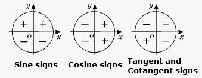

# `Signs` of trig functions
> Before solving a trig equation, need look at the `sign` of the equation, AND identify which one or multiple `quadrants` will the solutions land in. 

- `Quadrant I`: All trig functions are **POSITIVE**.
- `Quadrant II`: Only `sin(x)` is **POSITIVE**, others are all NEGATIVE.
- `Quadrant III`: Only `tan(x)` is **POSITIVE**, others are all NEGATIVE.
- `Quadrant IV`: Only `cos(x)` is **POSITIVE**, others are all NEGATIVE.

e.g.
`sin(x) = 123` have a positive sign, so it will have two solutions: one in `Quadrant I`, another be `Quadrant II`.
`-cos(2x+3)=234`have a negative sign, so it'll have two solutions in `Quadrant II` and `Quadrant III`.

Tricks:
In a `unit circle`, `X-axis` could be represented by `sine`, `Y-axis` by `cosine`.
So just think how `x` and `y` will be positive and negative in each quadrant will give you the answer.
Btw, `tangent` is equal to `sin(x)/cos(x)`, so it's easy to guess its sign too.
