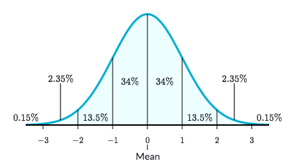

# `Empirical rule` (STATS)
> It's a rule describing a `Normal Distribution`.

It's also called the **`68-95-99.7% rule`**, because for a `normal distribution`:
- ≈68% of the data falls within 111 standard deviation of the mean
- ≈95% of the data falls within 222 standard deviations of the mean
- ≈99.7% of the data falls within 333 standard deviations of the mean

