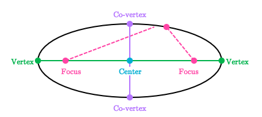
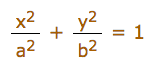

# `Ellipse` and its equation
> `Ellipse` is twisted circle, it got major features and equation from circle.



Ellipse got **TWO** radiuses (or radii):
- `Major radius`: the longer one.
- `Minor radius`: the shorter one.

## `Standard ellipse equation`
`a, b` is the radius on x-axis and y-axis. Ellipse originally centred at `(0, 0)`.



## `Foci of ellipse`
Since ellipse is part of `Conic section`, so it has the same identity:

There're **TWO** points on the `Major radius` of ellipse, so that any point on this ellipse has the same sum of distance to both points. These two points are called `Focuses` or `Foci`.

###  `How to find the Foci`
- Major radius on X-axis: `f² = a²-b²`
- Major radius on Y-axis: `f² = b²-a²`

### Foci identity
With the distance `D₁ and D₂`, their sum is equal to `Double Major Radius`:
```py
D₁ + D₂ = 2*r
```


