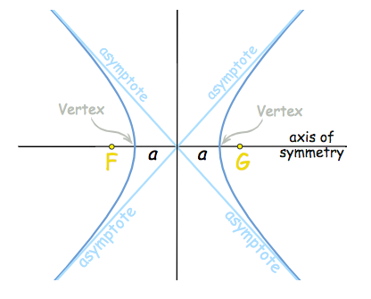
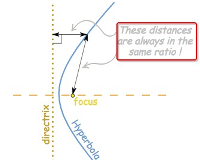
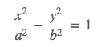
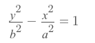
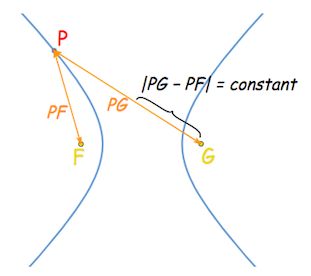
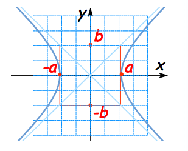
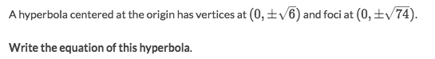

# `Hyperbola and its equation`

[Refer to Maths is fun.](http://www.mathsisfun.com/geometry/hyperbola.html)



`Hyperbola` can be defined as a `curve` where the `distances of any point` from:
- A point (the focus)
- A (the directrix) are always in the same ratio.




## `Equation of Hyperbola`

> Equation of hyperbola opens on the **`X-axis`**:


> Equation of hyperbola opens on the **`Y-axis`**:


Features:
- Two vertices: 
    - `(±a, 0)` when it opens on x-axis.
    - `(0, ±b)` when it opens on y-axis.
- Two asymptotes: 
    - `y = (b/a)x`
    - `y = −(b/a)x`


## `Foci of hyperbola`
> Any point `P` on the hyperbola to both focuses 

```py
|D₁ + D₂| = CONSTANT
```


### How to find foci of hyperbola

```py
f² = a² + b²
```
`f` is the `focal length`, which is the distance from the focus to the centre.
`a` is the distance from the vertex to the centre, when the vertices are on **X-axis**.
`b` is the distance from the vertex to the centre, when the vertices are on **Y-axis**.




### Example

Solve:
- Its centre is at `origin`, so the unknowns are `x² & y²`.
- According to its vertices, the hyperbola opens `Up & Down`.
- Since it's up&down, the formula is `y²/b² - x²/a² = 1`.
- And the `b² = √(6)² = 6`
- According to the `foci equation`: then it should be `74 = a² + 6`, and `a² = 68`.
- So the equation would be `y²/6 - x²/68 = 1`
