# Complex numbers


### `Imaginary number`

```py
# Assume that
i² = −1
# therefore the imaginary unit is
i = √(-1)
```

Powers of `Imaginary Unit`:
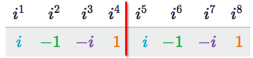
The pattern is from `i to i⁴`, then it repeats.
To evaluate `iⁿ`, just to get the remainder `n % 4` and see which term it is in the pattern. e.g., `i¹⁰` is equal to `-1` because `10 % 4 = 2` which is 2nd term in the pattern.


### `Complex Plane`
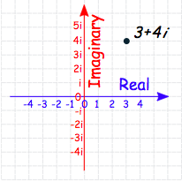

### `Conjugates`
> Its mainly usage is for the complex number's `division`.

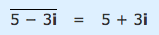


## `Forms of complex number`

[refer to khan academy article.](https://www.khanacademy.org/math/precalculus/imaginary-and-complex-numbers/modal/a/complex-number-forms-review)
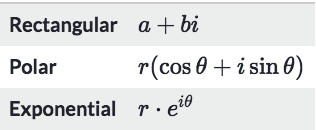

- `Rectangle form`
This form is good for plotting in the `complex plane`.
- `Polar form`
This form only refers to the `Absolute value` and `Angle`, 
which are also called the **`Modulus`** and the **`Argument`**.
- `Exponential form`
Its reasoning is too complicated, so just to remember it.
This form is very good for `complex number's` multiplication and division or further operations.
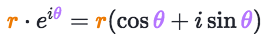


## `Operations of complex numbers`
> It's easier just see the `i` as an `unknown` variable, then to do normal operations.
[Refer to maths is fun.](http://www.mathsisfun.com/numbers/complex-numbers.html)

- `Addition & Subtraction`:
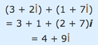
- `Multiplication`:
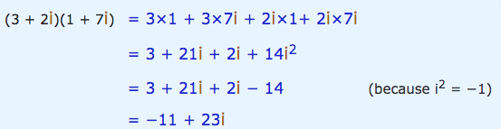
- `Division`: 
Need to use the notion `conjugates`
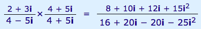
- `Powers`:
Better to convert it to `Exponential form` first, and do powers.
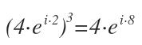


## `Convert between Rectangle form & Polar form`

**FORMS AND TECHNIQUES HERE, ARE RATHER APPLICABLE TO MANY TOPICS THAN MERELY FOR COMPLEX NUMBER. IT'S ACTUALLY FOR ALL TRIGONOMETRY RELATED TOPICS!!**

### `Absolute value of complex number`
> The `absolute value` of it literarily means the `DISTANCE` from the point of complex number to the `origin`.

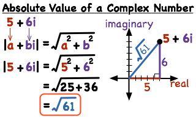

### How to understand this term?
**IT SPEND ME A LOT OF TIME TO UNDERSTAND AT THE FIRST TIME.**
In the example `5+6i`,
to calculate the absolute value of it `|5+6i|`, I know it's using the `Pythagorean theorem`.

But why it ISN'T doing `√(5²+6²i²)` instead of `√(5²+6²)`?
It is the most confusing part, and hard to consult the Internet with a clear answer that why do we **Take out** the `i` from calculating the distance.

The simple answer is that: 
No matter it's `i or i²`, it is either `√(-1) or -1`, in another word it actually is just a **NEGATIVE ONE**, 
but when we're counting a DISTANCE, it's always a POSITIVE, so we have to CANCEL OUT the `-1` from the number. That's the point we could ignore it when doing absolute value.

### `Angle of complex number`

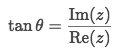

Note:
It only regards to the `tangent` knowledge of trig functions.
Better to review tangent identities to find all possible solutions of tan⁻¹(θ).
```py
tan(θ) = tan(-π + θ)
```

Steps:
- Find all solutions for angle θ.
- Plot rectangle form of complex number and figure out the `Quadrant`.
- Select the right solution at the right `quadrant`.

Example: Find angle for `z = −3 − 6i`
Solve:
- Principle solution: `θ = arctan(-6/-3) = 1.107` which is at 1st Quadrant.
- Another pair solution would be `-π + θ = -2.03` which is at 3rd Quadrant.
- `-3-6i` should be at the 3rd Quadrant in complex plane, so answer is `-2.03`.

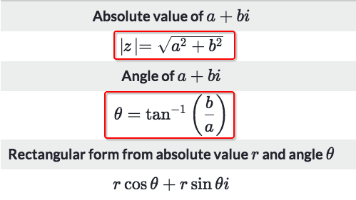

For some exact values, we also need the `tangent values of unit circle`:
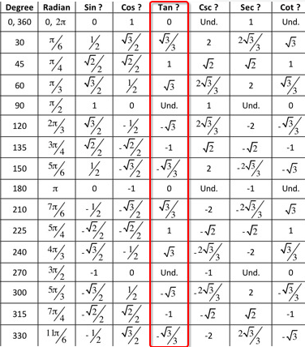


## `Convert between Exponential form & Polar form`
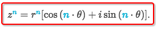

Example: Find the solution of `z⁴ = -625` in Rectangle form and Polar form, which argument in [270°, 360°]
Solve: 
It's actually a process of conversion:
- `-625` could be represented as `-625 +0i` in Rectangle form
- Modulus `r` is `√(-625²+0²)` which is equal to `625`.
- `tanθ = 0/-625 = 0`, check the tangent unit circle table to know the angle could be `0° or 180°`, according to its rectangle form, it's certain to be on the negative X-axis, so it's `180°`.
- Add all possible solutions and get the angle is `180° + n*360°`.
- Polar form is: `625[cos(180° + n*360°) + i*sin(180° + n*360°)]`
- since the complex number is `z⁴`, so:
    - Modulus = `⁴√625 = 5`
    - Argument = `(180° + n*360°) / 4  = (45°+n*90)`
    - Range of argument is [270°, 360°], so the argument is `315°`
    - So the Polar form is: `5(cos315 + i*sin315)`.
    - Rectangle form is: `5√2/2 - i*5√2/2`
    


## Powers of complex numbers

### Example
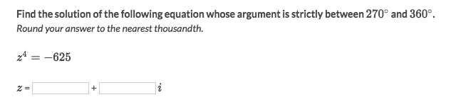
Solve:
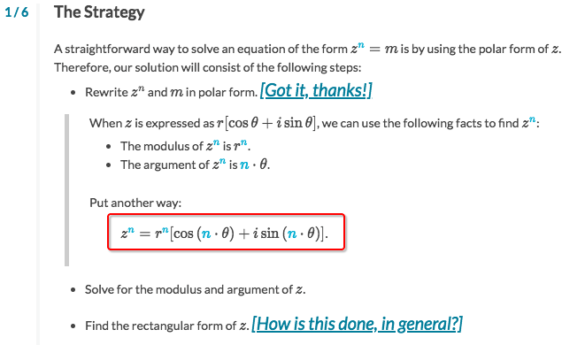
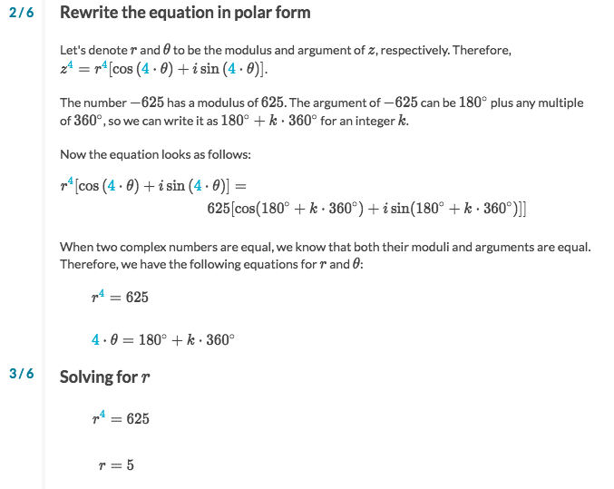
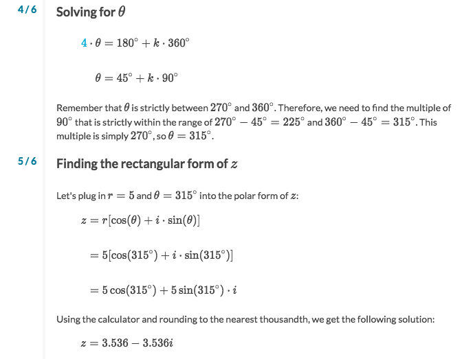

