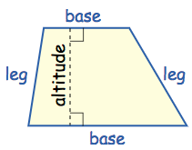
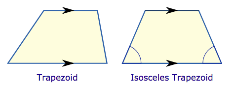
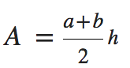
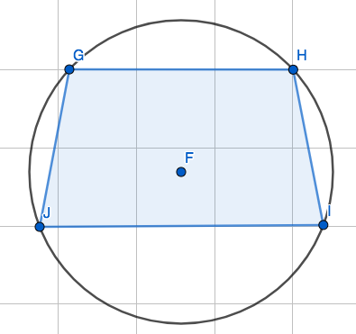

# `Trapezoid`
> Definition: A trapezoid is a quadrilateral with **two parallel sides**.

[To play with trapezoid, Refer to GeoGebra](https://ggbm.at/runpCeja)

Trapezoid
- Scalene trapezoid: No equal sides.
- Isosceles trapezoid: Two legs are equal.

## `Area of trapezoid`

## `Trapezoid inscribed in a circle`

- Remember that a `trapezoid` has to have **TWO BASES** to be parallel.
- Know that, a `quadrilateral` CAN be inscribed in a circle or even a semicircle, which means 4 vertices  are all on the circle. 
- Since it's a `trapezoid`, and inscribed in a circle, then **IT HAS TO BE A ISOSCELES TRAPEZOID.** No matter its side crosses the centre or not.
- 
