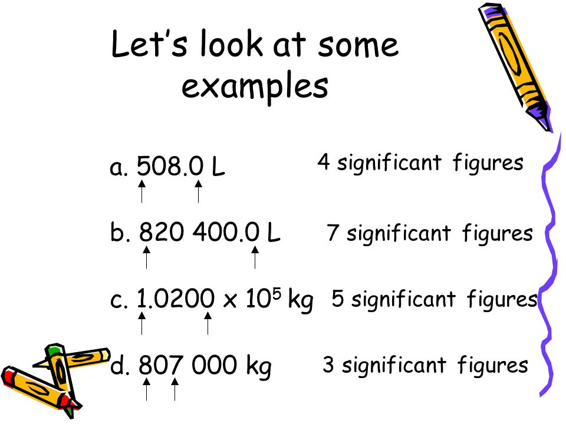
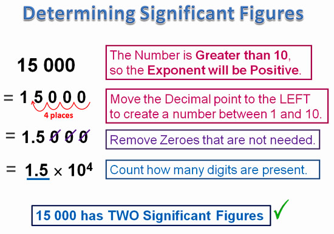

# `Significant Figures` (Significant digits)
> The term "significant figures" refers to the digits, in a number or measurement, which show the accuracy of the number. 

[Refer to wiki: Significant figures](https://www.wikiwand.com/en/Significant_figures)
[Refer to Khan academy: Intro to significant figures](https://www.khanacademy.org/math/arithmetic-home/arith-review-decimals/modal/v/significant-figures)

## Rules of Significant figures

`Concise Rules`:
- All **non-zero** digits are significant: 1, 2, 3, 4, 5, 6, 7, 8, 9.
- Zeros **between** non-zero digits are significant: 102, 2005, 50009.
- Leading zeros are **NEVER** significant: 0.02, 001.887, 0.000515.
- In a number with a decimal point, trailing zeros (those to the right of the last non-zero digit) are significant: 2.02000, 5.400, 57.5400.
- In a number without a decimal point, trailing zeros may or may not be significant. More information through additional graphical symbols or explicit information on errors is needed to clarify the significance of trailing zeros.

