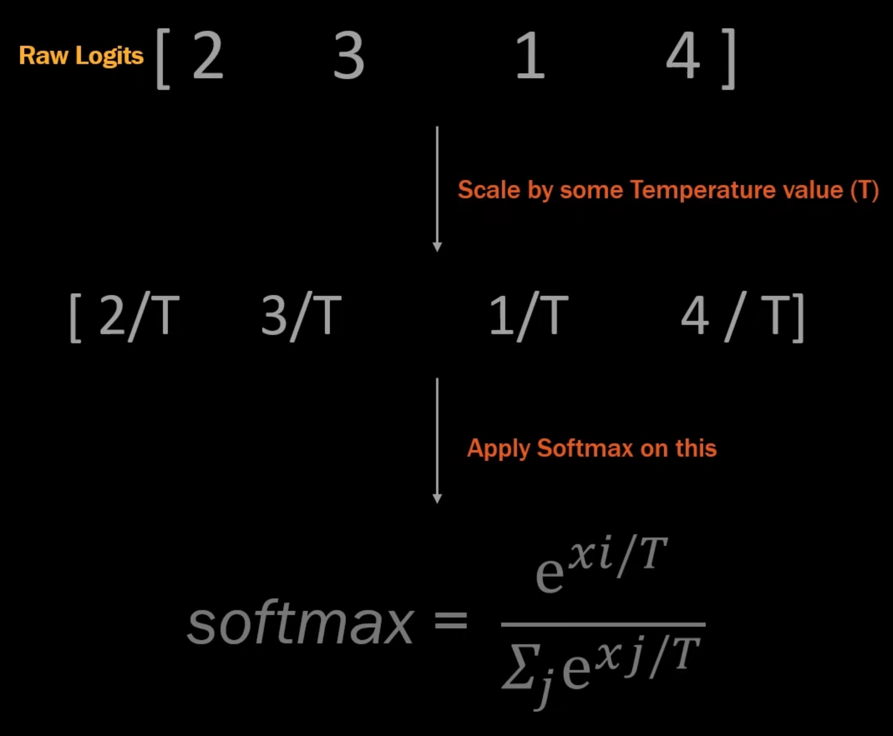
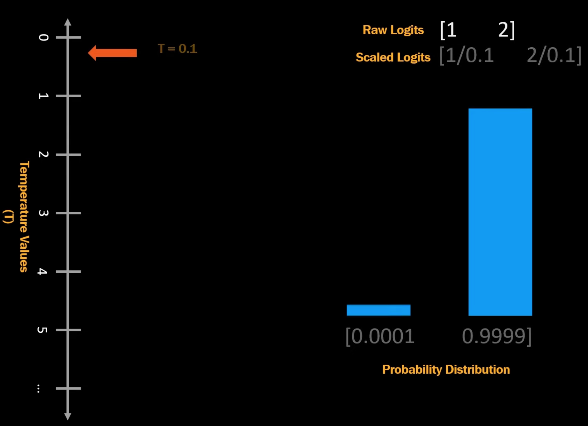

# What is "temperature" in LLM

REF: [What is Temperature in LLM](https://www.youtube.com/watch?v=jnikMver_CE&list=PLUfbC589u-FSwnqsvTHXVcgmLg8UnbIy3&index=1)

When predicting the next word, if we use traditional method `Greedy sampling`, then it always choose the most probable one, which makes the whole response always the same, which is boring.

`Temperature scaling` uses a technique that levels the probability of candidate words, from 0 ~ N, the higher temperature value is, the more similar the candidates are.

The `temperature value` is applied to the "raw logits" before applying `softmax()` function.

