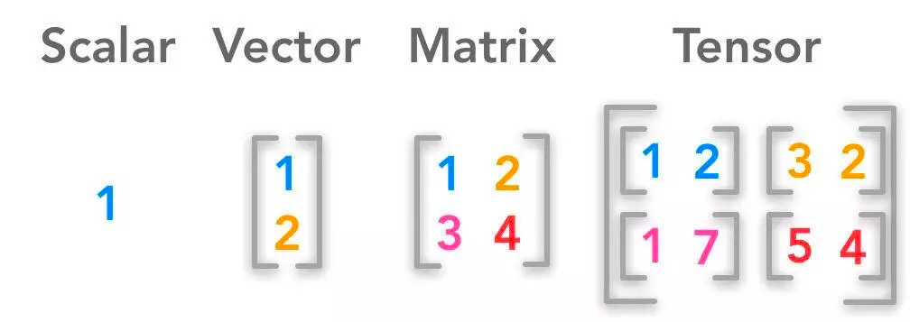
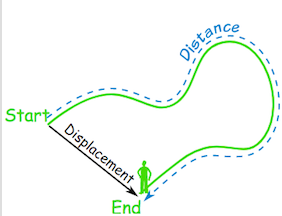
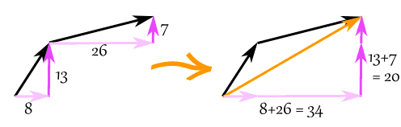
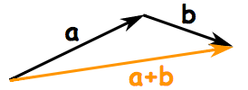
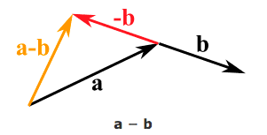
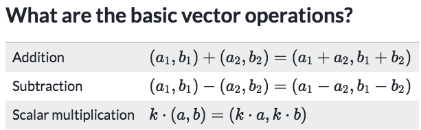

# ❖ Vector Intro

## What is a 「vector」
> Definition: vector is a **MAGNITUDE** with a **DIRECTION**

Notation: 
- `v` as a vector.
- `|v|` or `||v||` as its **Magnitude**, or **Length**, or **Distance**, or **Absolute value**, same idea
- **Slope or angle** as its **Direction.**
- `(a, b)` the two position there are called `X-component & Y-component`.

It's not hard to understand the basic ideas of a vector, which consists of very basic knowledges form what we learned previously in high school:
- Magnitude of vector: is the same with calculating the **distance of two points**
- Direction of vector: is the same with calculating the **slope of a line**.

### 「Distance」 vs. 「Displacement」
- Distance is a **scalar** ("3 km")
- Displacement is a **vector** ("3 km Southeast")

### 「Speed」 vs 「Velocity」
- Speed is how fast something moves.
- Velocity is speed with a direction.

## UNDERSTAND VECTOR'S 「MOVEMENT」
Now we got a vector start from `(-3,8)` to the point `(4, 5)`.  
We say this vector has a magnitude `||v|| = √40` and has a direction to the bottom right.
But we could also represent the vector as only `one point with two components`: `(7, -3)`.
Which has a **HIDDEN INFORMATION** that it start from the **origin** and direction is to the point `(7, -3)`.
Are they different vectors? NO! They're the same vector, just starts at different places.
> Because **vector doesn't specify where it starts.** A vector only means `A magnitude & a direction`.

That's why we could represent a vector in two ways:
- `v is (-3,8) to (4, 5)`
- `v = (7, -3)`

**IT'S VERY IMPORTANT TO UNDERSTAND THIS IDEA, SO THAT WE COULD FURTHER UNDERSTAND WHY WE COULD MOVE VECTORS, AND BY SO WE COULD DO SUMS AND MULTIPLICATIONS AND SO ON**

## 「Adding」 & 「subtracting」 vectors
> "Linear algebra is built on these operations `v + w` and `cv`: **Adding vectors and multiplying by scalars.**" - Gilbert Strang

Adding & subtracting could be seen as a movement to a vector, or say how it travels.

[Refer to Maths is fun.](http://www.mathsisfun.com/algebra/vectors.html)

- Adding vectors:

- Subtracting vectors: is just **ADDING** a **NEGATIVE VECTOR**

### Understand vector's 「addition & subtraction」
Refer to _Intro to Linear Algebra by Gilbert Strang: 1.1_.

**"You can't add apples and oranges."**
But you can add **fruits**!
Imagine you have one bag of fruits `(3 apples, 4 oranges)`, and another bag of fruits `(1 apple, 2 oranges)`.
So adding them together you will get one big bag of fruits `(4 apples, 6 oranges)`,
from this big bag you could also split a smaller bag of fruits, and then you will call it `subtraction`.

A vector is the very idea of **a bag of fruits**.

## 「Scalar Multiplication」
> It's the same with the section `DILATION` or `Scaling` in Geometry. 

Just for review of `dilating` a graph geometrically:
When you scale a graph by a factor:
- Every line of the graph scale by the SAME factor
- Every line will be PARALLEL to its origin line.

[Refer to previous note: Transformation.](https://github.com/solomonxie/solomonxie.github.io/issues/44#issuecomment-371067923)

