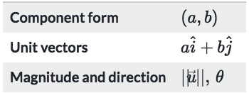
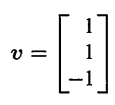
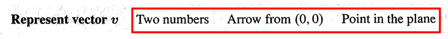
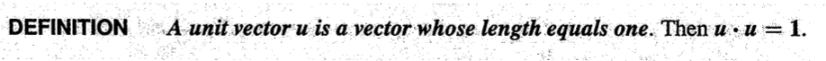
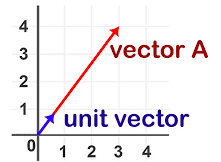
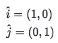
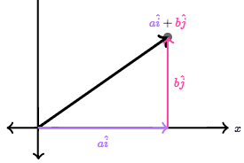
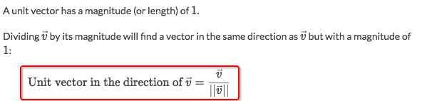
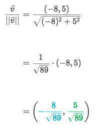

# ❖ Vector forms

[Refer to Khan academy article.](https://www.khanacademy.org/math/precalculus/vectors-precalc/magnitude-direction/a/vector-forms-review)

In Gilbert Strang's _Intro to Linear Algebra_, it's different point of view:

For row form or column form:
- `Row form`: v = (1, 1, -1)
- `Column form`: 

> "The reason for the row form (in parentheses) is to save space. But v = (1,1, -1) is not a row vector! It is in actuality a column vector, just temporarily lying down. "

For representing method:

## 「Unit vectors」

> Simply say, a `unit vector` is just a vector which length is `1`. Kinda like the unit circle idea.
It's also called `Engineering notation`, or the `basis vector`.

Which means, it could lie on axis or in between.

**What's it for?**
Basically just like the unit circle, make things easier to calculate angles or length or so. 
Actually it's working together with unit circle and all other trigonometric knowledges.
so, 
**UNIT VECTOR IS RATHER A TRIGONOMETRIC WAY TO DEAL WITH VECTORS.**
Easier to think about it, is to think about the `Similar graph` knowledge in the `Dilation` section. 

### 「Standard Basis Vectors」 & 「Unit vector」 form

> It's also called `Unit Basis Vectors`.
`Unit vector` is easy, but `unit vector form` needs your bit more effort to understand.

**THIS FORM DOESN'T PRESENT VECTOR AS A POSITION ANYMORE, RATHER PRESENT IT AS HOW MUCH IT STRETCHES UNIT VECTORS, OR SAY PRESENT IT AS A SCALAR.**

Assume that there are **TWO** unit vectors, one vertical, one horizontal.

### How to find a vector's 「unit vector」

> More intuitively to solve it just to draw it out and solve it with trigonometry. 

Example: Find the unit vector of vector (-8, 5)

## Convert between 「vector forms」

**HIGHLY RECOMMEND TO REVIEW THE COMPLEX NUMBER CONVERSION SKILLS, HAVING THE VERY SAME IDEA.**
[Refer to previous note: complex number forms conversion skills.](https://github.com/solomonxie/solomonxie.github.io/issues/44#issuecomment-379646389)

### How to find the 「direction angle」 of a vector

> It's the very same problem of the topic `Inverse trig function`. 

**NOT EASY! NEED TO CONSIDER LOTS OF CONDITIONS, LIKE QUADRANTS, POSSIBLE SOLUTIONS, PRINCIPLE SOLUTION AND SO. RECOMMEND TO REVIEW INVERSE TRIG FUNCTIONS.**

[Refer to previous notes: Inverse Trigonometric equations.](https://github.com/solomonxie/solomonxie.github.io/issues/44#issuecomment-377686394)

Example: Find the direction angle of vector `(-2, 5)` between 0° to 360°.
Solve:
- `tanθ = (-5/2)`
- `θ₁ = -68.2`
- `θ₂ = 180° + -68.2 = 111.8` because θ₁ is negative could use this trig identity.
- Vector `(-2, 5)` is located on Quadrant-2, 
- So the answer is `111.8`.
