# ❖ Inverse Matrices

> There is actually no concept of `division of matrix`. But similarly we can let it `multiply an inverse` to achieve the same goal.

Refer to 3Blue1Brown: [Inverse matrices, column space and null space ](https://www.youtube.com/watch?v=uQhTuRlWMxw&list=PLZHQObOWTQDPD3MizzM2xVFitgF8hE_ab&index=8)
[Refer to maths is fun: Inverse of a Matrix.](http://www.mathsisfun.com/algebra/matrix-inverse.html)

**SPOILER ALERT: EVEN 3x3 MATRIX INVERSE IS ALREADY TOO HEAVY TO CALCULATE, SO BETTER JUST TO MEMORISE THE 2x2  AND LET COMPUTER DO ALL THE HIGHER DIMENSIONS.**

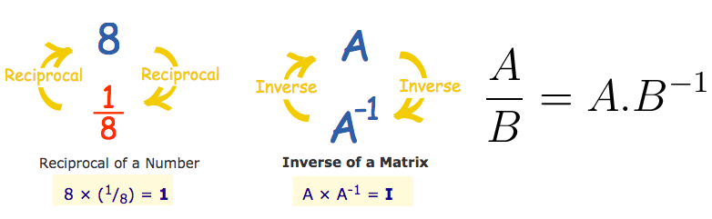

## Understand the 「Inverse Matrix」

> 3Blue1Brown's video perfect explained the intuition of it, pretty much everything you need to know.
[Link: Inverse matrices, column space and null space ](https://youtu.be/uQhTuRlWMxw?t=3m58s)

**It makes lots more sense in geometric meanings, that an Inverse Matrix just to RECOVER the transformation of a graph back to before.**

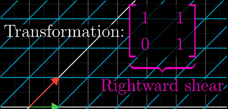

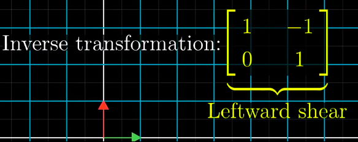

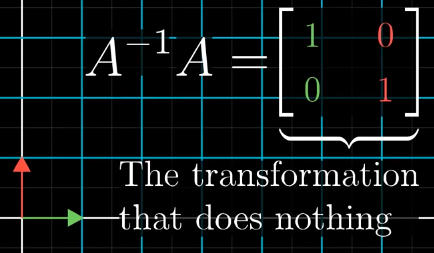

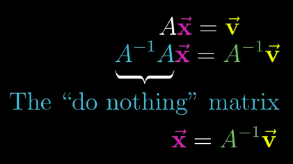

### Why is the 「Inverse Matrix」 at the Left of Vector

Because Matrix `A` is always as a `"Coefficient"` to the vector, or as a `transformation rule` to the vector, so it's always on the left of the vector ( or the graph).

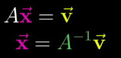

## 「Identity Matrix」

> It's a simple yet important notation for doing dividing a matrix.

The `Identity Matrix` is the matrix equals to the number of `1`:
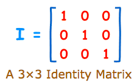

> It's very much more intuitive to think a `identity matrix` as **`one unit vector`**.
- 1-Dimension: `x = 1`
- 2-Dimensions: `v = (1, 1)`
- 3-Dimensions: `v = (1, 1, 1)`

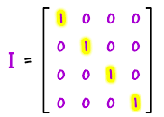

### The features of 「Identity Matrix」

- It is `square` (m×m Matrix)
- It can be large or small (2×2, 3×3, 100×100, ... whatever)
- It has `1`s on the diagonal and `0`s everywhere else
- Its symbol is the capital letter `𝗜`

More importantly, **IT CAN SWITCH SIDE WHEN MULTIPLYING ANOTHER MATIRX!**
It's very special, and is the **ONLY** matrix can IGNORE the order when multiplying another matrix.
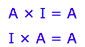

## 「Not Invertible」 Matirces

Two conditions make a matrix NOT invertible:
- The matrix is not a `Square Matrix` (m×m matrix).
- The `Determinant` is **ZERO**. Such matrix is also called a **`Singular matrix`**

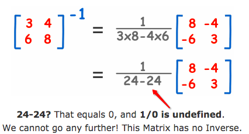

## 「Adjugate Matrix」

> It's also called the `Adjoint of a matrix`, or `Classical Adjoint`.

Refer to maths is fun: [Inverse of a Matrix using Minors, Cofactors and Adjugate.](https://www.mathsisfun.com/algebra/matrix-inverse-minors-cofactors-adjugate.html)

### 「Adjugate」 of 2x2 Matrix

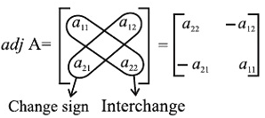

## Calculate the 「Inverse」 of a 「Matrix」

> "Calculating it for a 2x2 is fairly straightforward, 3x3 becomes a little bit hairy, 4x4 will take you all day, 5x5 you're almost definitely gonna do a careless mistake if you do an inverse of matrix." - Sal Khan

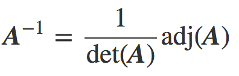

### 2x2 Matrix inverse

> With a 2x2 matrix, you really don't need to think much and waste time on the full steps, just simply follow this formula `1/Determinant × Adjugate`

[Refer to Khan lecture.](https://www.khanacademy.org/math/precalculus/precalc-matrices/modal/v/inverse-of-a-2x2-matrix)

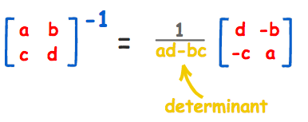

### 3x3 Matrix inverse

We can calculate the Inverse of a Matrix by:
- Step 1: calculating the Matrix of Minors,
- Step 2: then turn that into the Matrix of Cofactors,
- Step 3: then the Adjugate, and
- Step 4: multiply that by 1/Determinant.

> **I tend not to note the full content here, because it's so useless in normal math life. Because it's way to hairy to calculate even with a 3x3 matrix. So just get the idea and let computer do the rest.** 

### Example
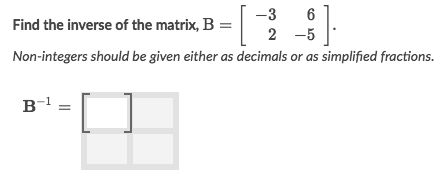

Solve:
- The formula for Inverse Matrix is `Adjugate(A) / Determinant(A)`.
- The Determinant of A is `-3*-5 - 2*6 = 3`
- The Adjugate of A is `[(-5, -2), (-6, -3)]`
- So the answer is :
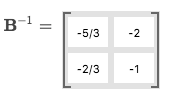

## Solving 「Systems of equations」 with 「Inverse Matrices」

[Khan lecture: Solving linear systems with matrix equations](https://www.khanacademy.org/math/precalculus/precalc-matrices/modal/v/solving-matrix-equation)

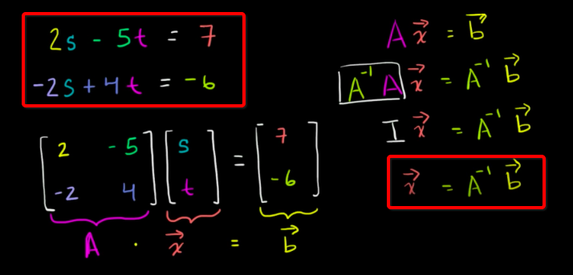

