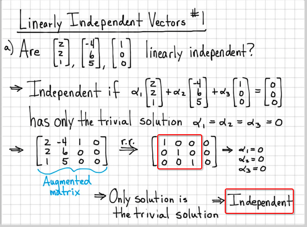
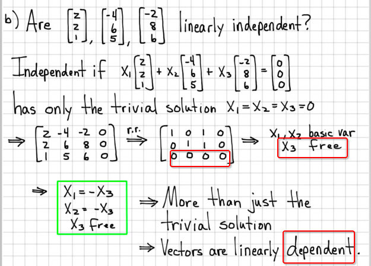

# Vector span

**It's extending the `unit vector` idea.**

Refer to famous visualisation of 3Blue1Brown's video: [Linear combinations, span, and basis vectors](https://www.youtube.com/watch?v=k7RM-ot2NWY&t=0s&list=PLZHQObOWTQDPD3MizzM2xVFitgF8hE_ab&index=3)

## 「R²」 and 「R³」

`R²` means a `Real numbers 2D plane`.
Usually the `X/Y Axes plane` is this one.

`R³` means `Real numbers 3D plane`.
Usually the `X/Y/Z Axes plane`.

## 「Linear combinations」 (Vector Addition)

> DEFINITION: The sum of `cv` and `dw` is a linear combination of `v` and `w`.

`Linear combinations` means to add vectors together: `v₁ + v₂ + v₃.....` to get a new vector. Simple like that.

## 「Span of vectors」

> It's the **Set** of all the `linear combinations` of a number vectors.


```py
# v, w are vectors
span(v, w) = R²

span(0) = 0
```

`One vector` with a `scalar`, no matter how much it stretches or shrinks, **it ALWAYS on the same line**, because the direction or slope is not changing. So **ONE VECTOR'S SPAN IS A LINE.**

`Two vector` with `scalars`, we then **COULD** change the slope! So that we could get to any position that we want in the 2D plane, i.e., R².

Exceptions:
- `span(0) = 0`, it only stay at origin.
- `v = w`, if two vectors are the same, or `collinear`, then it's still ONE vector.

## Linearly 「dependence」 & 「independence」

- `Linear dependence`: two vectors are **`COLLINEAR`**, means on the same line.
- `Linear independence`: two vectors are **`NOT COLLINEAR`**, means they're not on the same line.

Vectors `(2, 3)` and `(4, 6)` are the **SAME VECTOR**! 
Because `(4,6) = 2*(2,3)`, so it's just a scaled version of the first vector.

So we say the vectors `(2, 3)` and `(4, 6)` are **`DEPENDENT`**, because they're **`COLLINEAR`**.

Other than that, any two vectors are **`INDEPENDENT`**, if they're not **NOT COLLINEAR**.


### List of some 「linear combinations」

Let's list some `vector combinations`:
- Zero Vector: `span(0) = 0`.
- One vector: `span(v) = a line`.
- Two vector: `span(v₁, v₂) = R²`, if they're not collinear.
- Three vector or more: `span(v₁, v₂, v₃...) = R²`. Other than two vectors, are all **`REDUNDANT`**. 
In another word:
**IF ANY TWO VECTORS ARE INDEPENDENT, THEN OTHERS ARE ALL DEPENDENT.**

## How to calculate a 「linear combination's independency」

[Refer to Adam Panagos: Linear Algebra Example Problems - Linearly Independent Vectors #1](https://www.youtube.com/watch?v=rQZD3RM9ic0)
[Refer to TheTrevTutor: [Linear Algebra] Linear Independence and Bases](https://www.youtube.com/watch?v=OLqc_rt7abI)
[Refer to Khan lecture: Span and linear independence example](https://www.khanacademy.org/math/linear-algebra/vectors-and-spaces/linear-independence/v/span-and-linear-independence-example)

> It's important for knowing if a `linear combination` can fill out a plane or space. 
For example, if two vectors aren't independent, then it's just one vector, and can only draw a line. If three vectors aren't independent, then they're just two vectors, one is redundant, so they can only fill out a 2D plane instead of a 3D space.

A `linear combination` is **independent**, **iff** it could satisfy this equation:
```py
c₁v₁ + c₂v₂ + c₃v₃ .... = 0
```
`c..` means the scalar for each vector, and you could change the scalar to any number, positive or negative.
Note that: `c ≠ 0`, and vectors are not all zeros.

Assume that there's a linear combination of two vectors `v₁ + v₂ + v₃`, 
with scalars it could be `c₁v₁ + c₂v₂ + c₃v₃`.
To verify whether it's dependent or independent, 
we assume `c₁v₁ + c₂v₂ + c₃v₃= (0,0,0)` and solve for `c₁, c₂, c₃`:
- it's **independent** <=> if `c₁ = c₂ = c₃ = 0` **all** are zeros
- it's **dependent** <=> If `c₁, c₂, c₃` **at least one** is NON-ZERO number

Independent Example:



Dependent Example:


