# ❖ Vectors multiplication

> Vector multiplication is FUNDAMENTAL skill to solve `Matrices multiplication`.

**THE VERY FIRST THING TO DO WITH A `VECTOR MULTIPLICATION` OR `MATRIX MULTIPLICATION`, IS TO FORGET EVERYTHING ABOUT `ARITHMETIC MULTIPLICATION` !!**
OTHERWISE, YOU WILL FALL INTO AN ENDLESS CONFUSION!

Just to know, multiplication of vectors or matrices, **AREN'T** really multiplication, but just look like that. You can see them as **operations to get SOMETHING**.

There're two operations are called `multiplication` for vectors:
- `Dot product`: express as `V₁ · V₂`, named for the dot symbol. It's meant to get the `Product of two magnitudes`.
- `Cross product`: express as `V₁ × V₂`, named for the cross symbol. It's meant to get a `new vector`.

> The `cross product` is very very very limited in use, and NOT as fairly often in use as the `dot product`. So don't waste time on this unless having certain use of it.

## 「Boosting」

**IT'S THE VERY CORE SENSE OF MAKING A MULTIPLICATION OF VECTORS OR MATRICES.**

Multiplication **ISN'T** just `Repeat counting in Arithmetic` anymore.
Not `4×3 = 4+4+4` anymore!

It's rather kind of `Growth`, or empowerment, or **boosting**.
We'd say `we tripled 4`, or say `number 4 grow with speed of 3`, or to say `number 4 grows with a boosting of 3`.
Whatever you'd say, you get the idea.
Multiplication a process of `double, triple, quadruple ...`.

**JUST TO REMEMBER: FORGET ABOUT ARITHMETIC MULTIPLICATION, ALWAYS SEE MULTIPLICATION AS BOOSTING.**

## 「Dot Product」

**REMEMBER: A DOT PRODUCT DOESN'T GIVE YOU A VECTOR, BUT ONLY A NUMBER, A SCALAR, A PRODUCT OF TWO MAGNITUDES.**

> The purpose:
It is **NOT** to get a new vector, and **NOT** to `Reduce dimension`, 
its only purpose **IS** to get a **quantity**, a magnitude, a number!

[For an intuitive video refer to Khan academy physics: Dot Product.](https://www.khanacademy.org/science/physics/magnetic-forces-and-magnetic-fields/electric-motors/v/the-dot-product)
[For more explains in detail: Vector Calculus: Understanding the Dot Product](https://betterexplained.com/articles/vector-calculus-understanding-the-dot-product/)
[Maths is fun: dot product.](https://www.mathsisfun.com/algebra/vectors-dot-product.html)
[3Blue1Brown: Dot products and duality | Essence of linear algebra](https://www.youtube.com/watch?v=LyGKycYT2v0&list=PLZHQObOWTQDPD3MizzM2xVFitgF8hE_ab&index=10)

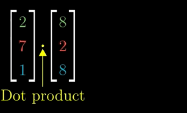

## Understand Dot product in 「business」

Refer to _Intro to linear algebra by Gilbert Strang: 1.2_.

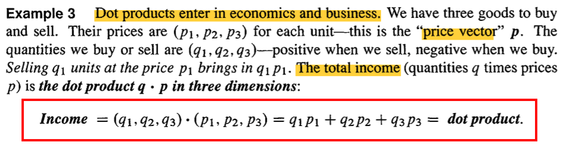

## Understand Dot product in 「physics」

> It makes lots more sense to think `dot product` in **physics** way than maths algebraic way.

**Just to think `Two forces` "a & b" are `pulling` a box,** 
so how much power did it pulled on the `direction of a`, or how much on the `direction of b`?

### Vectors on 「same direction」

Let's make it easier before digging in:
assume there's no angle, `Two forces` "a & b" are `pulling` to the same way, the same direction,
so how much power would it be pulled?

Well, the force `a & b` working together, it's a process of **`Boosting`** the energy! 
**It's not ADDING together anymore**, it's `BOOSTING`!
Let's say the force `a` has `3 units` power, `b` has `6 units` power. 
So every `1 unit` power `a` pulls, `b` will pull `2 units` power.
Then it make sense:
The total power pulling the thing would be `3 · 6 = 18 units`

### Vectors on 「different direction」

So the `Two forces` AREN'T pulling the box at the same direction anymore, how much power did it pulled on the `direction of a`, or how much on the `direction of b`?

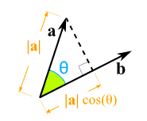
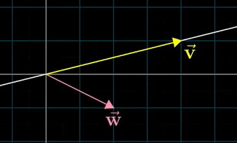

Let's think about how much power it's pulling on the direction of `b`.
Since `a` is pulling on a bit **wrong way**, so **`a`'s power ISN'T 100% working on `b`'s way**.
How much power left there?
It depends on the angle.
So to calculate how much left, we use `|a| × cos(θ)`, 
and we got a **PROJECTION** or a reflection or a **shadow** of `a` on `b`! 
Then it become like this picture again:

How amazing it is!
And now we could **Boost** the power on b: `|b| ×  |a|×cosθ`

## Ways of calculating dot product

There're two ways to calculate the dot product (I made up the names):
- Shadow Boost: 

- Axes Boost: 

Result of two ways are **SAME**.

> Remember: Boosting is not working when two vectors are **Perpendicular**, which product is `0`.

### 「Shadow Boost」

> We reflect one vector on another one, then **Boost** the energy.

Intuition:
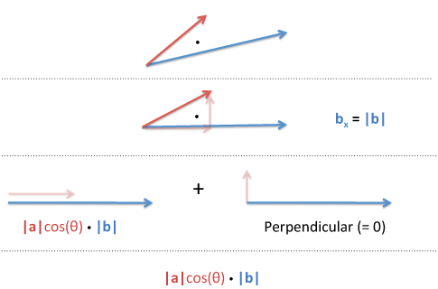

### 「Axes Boost」

> We break two vectors to `X-axis` and `Y-axis`, and BOOST on each axis.

Easier to remember the formula is:
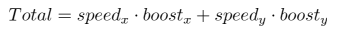

Intuition:
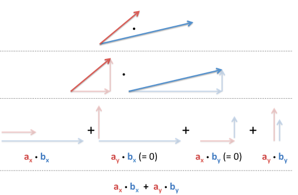

### Examples:
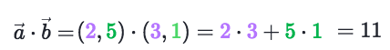
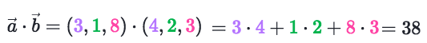

### Example
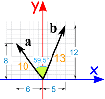
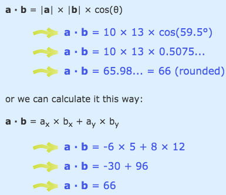

## 「Dot product」 & 「Symmetry」

> Dot product has a relationship with Symmetry.

[Refer to lecture of Imperial College London: Einstein summation convention and the symmetry of the dot product](https://www.coursera.org/learn/linear-algebra-machine-learning/lecture/kI0DB/introduction-einstein-summation-convention-and-the-symmetry-of-the-dot-product)

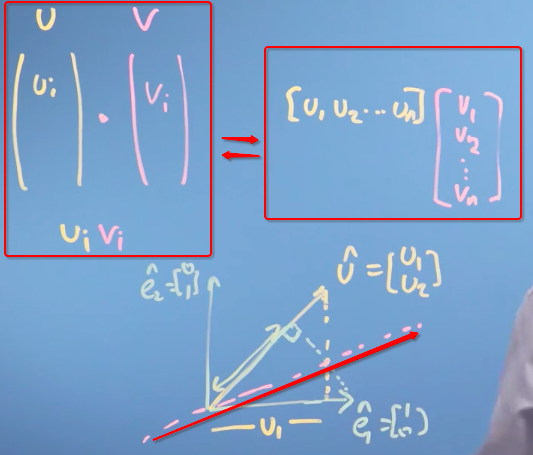

