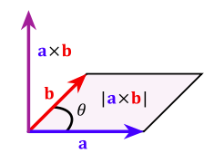
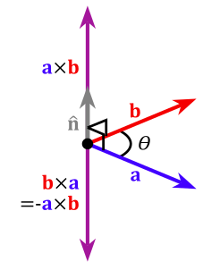
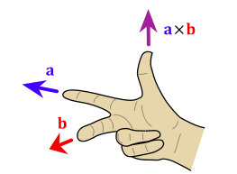

# Cross product [DRAFT]

> Actually the `cross product` is very very very limited in use, and as fairly often as the `dot product`. 

**So don't waste time on this unless having certain use of it.**

**REMEMBER: A CROSS PRODUCT ONLY HAS USE IN 3-DIMENSIONS, AND ORDER MATTERS, AND GIVES YOU A NEW VECTOR.**

List it again:
- Only work for 3-Dimensions
- Order matters
- Gives a new vector

`Right-handed system`:

