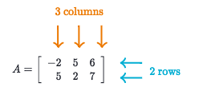
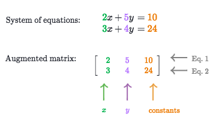
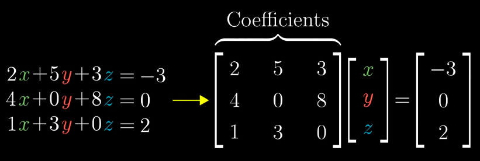
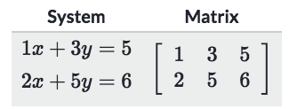
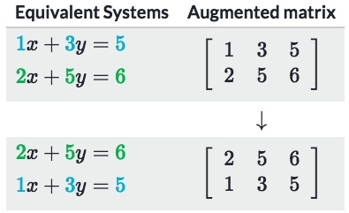
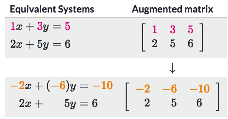
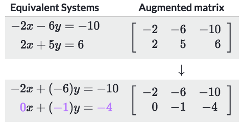
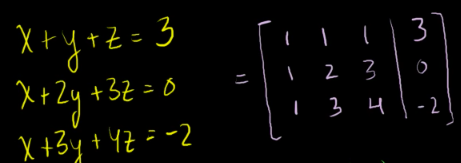
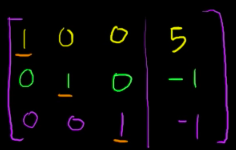

# Matrix intro

> `Matrices` are just a **rectangle array of numbers**.

Prerequisites: `Systems of equations`

Matrices could be seen as a group of informations arranged **IN A CERTAIN WAY**.
**IT'S SO SO SO SO SO EASIER TO THINK IT AS A SYSTEM OF EQUATIONS.**

## 「Matrix row operations」 & 「Systems of equations」

> It's very SAME with operations of `systems of equations`.

[Refer to Khan academy article: Matrix row operations](https://www.khanacademy.org/math/precalculus/precalc-matrices/elementary-matrix-row-operations/a/matrix-row-operations)

There're different types of row operations:
- Switch any two rows
- Multiply a row by a nonzero constant
- Add one row to another

They all relate to the operations of systems of equations:
### Switching any two rows:

### Multiply a row by a 「nonzero constant」

### Add one row to another

## Solve 「system equations」 using Matrix

> it's also called the **`Row-Echelon form and Gaussian elimination`**.

[Khan lecture: Reduced row echelon form](https://www.khanacademy.org/math/precalculus/precalc-matrices/modal/v/matrices-reduced-row-echelon-form-2)
[Refer to Ck-12: Row Operations and Row Echelon Forms](https://www.ck12.org/c/algebra/row-operations-and-row-echelon-forms/lesson/Row-Operations-and-Row-Echelon-Forms-PCALC/?collectionCreatorID=3&conceptCollectionHandle=algebra-%3A%3A-row-operations-and-row-echelon-forms&collectionHandle=algebra)
[Example of "RREF": Lec 01 - Linear Algebra | Princeton University](https://youtu.be/Ncu9Pks3AJQ?t=29m54s)

> It's a so serious problem in all the first lesson of Linear algebra courses. It seems simple yet not easy to solve by yourself. You need to understand all the steps of how to do a `REF` or `RREF`, aka. `Reduce Row Echelon Form`.

The important note to apply the `RREF` is to know how the `Pivot`, or the `Cursor` moves. 
It's more efficient to understand it with 1 or 2 practice rather than see notes here.

First we need to rewrite the system of equation to `matrix` form:

Then by `row operations`, we need to achieve this kind of result, which is also called **Reduced Row Echelon Form**:

It means we eliminated all other variables and only left 1 variable in one equation, which is called **`Identity Matrix`**. Then you could put back the number to the system of equations.

