# ❖ Matrix Multiplication

**IT IS A WHOLE NEW AREA ASIDE FROM MATRICES BASIC OPERATIONS**.

It's very difficult to make sense of it. But mathematicians just somehow make it work, it then is a `Human defined operation`, it makes no sense but you just have to deal with it. 
If you just need to solve the problem, you only need 5 minutes to get it around, and then you can skip all these below. 
But if you'd like to understand it, then prepare yourself for a couple of hours or days on this.

> It's necessary to make you confused with the operation below. Because that's most teachers start with to teach you how to multiply matrices. Don't worry, we're to skip this one and find a better perspective to solve it.

[Refer to Khan academy article: Multiplying matrices](https://www.khanacademy.org/math/precalculus/precalc-matrices/multiplying-matrices-by-matrices/a/multiplying-matrices)
[Refer to 3Blue1Brown: Dot products and duality](https://www.youtube.com/watch?v=LyGKycYT2v0&list=PLZHQObOWTQDPD3MizzM2xVFitgF8hE_ab&index=10)
[Refer to maths is fun: How to Multiply Matrices](https://www.mathsisfun.com/algebra/matrix-multiplying.html)

This topic is very easy to use but very difficult to understand! 
But I rather to understand it instead of just memorising it. 
So this is the **Learning path** of this topic:
1. Dot product
2. **Linear transformations**
2. Matrix-vector product
3. Matrix-matrix product

## Understand Matrix multiplication

There're so many different ways to understand it, to make sense of it, because it's so hard to understand.

The major fond of ways to understand are:
- Through `Matrix transformation`
- Through `Real-life example`
- ~Through Algebraic methods~

Although `Real-life example` makes sense easily, but it aren't gonna help solving problems well.
So `Matrix transformation` is the ultimate way to understand Matrix multiplications.
And it proved that it is the best way for that, and for all core ideas of `Linear Algebra`.

Before we start, let's make things clear:
- Dot product: Vector * Vector
- Matrix-vector product: Matrix * Vector
- Matrix-Matrix product: Matrix * Matrix

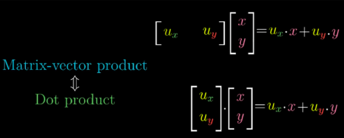

Refer to Khan lecture video: [Matrix vector products as linear transformations](https://www.khanacademy.org/math/linear-algebra/matrix-transformations/linear-transformations/v/matrix-vector-products-as-linear-transformations)

> In the GPU of a computer,
**"ALL THE GRAPHIC PROCESSORS ARE JUST HARD-WIRED MATRIX MULTIPLIERS! ALL THEY DO IS JUST MULTIPLYING MATRICES!" - SAL KHAN**

## Linear transformation

> There're so many different ways to understand Matrix Multiplications, 
and **Linear Transformations** is the best and probably the only one makes sense and perfect intuition to you, i.e. it might be the only chance to understand it after all.

**LINEAR TRANSFORMATION IS THE VERY KEY TO OPEN UP ALL GETES IN LINEAR ALGEBRA, BECAUSE IT MAKES PERFECT SENSE OF MATRIX MULTIPLICATION.**

To understand `matrix multiplication`, Linear Transformation is the very first thing you want to learn. It's fairly important and can't get away with.

> `Linear transformation` is a special kind of Transformation, which deals with `vectors`.

Need to mention that, 3Blue1Brown has done well on build intuition on this topic:
Refer to 3Blue1Brown's video: [Linear transformations and matrices](https://www.youtube.com/watch?v=kYB8IZa5AuE&list=PLZHQObOWTQDPD3MizzM2xVFitgF8hE_ab&index=4)
Refer to the same video: [How does linear transformation work on unit vectors](https://youtu.be/kYB8IZa5AuE?t=3m47s)
Refer to 3Blue1Brown's video: [Three-dimensional linear transformations](https://www.youtube.com/watch?v=rHLEWRxRGiM&list=PLZHQObOWTQDPD3MizzM2xVFitgF8hE_ab&index=6)
Refer to 3Blue1Brown's video: [Matrix multiplication as composition](https://www.youtube.com/watch?v=XkY2DOUCWMU&index=5&list=PLZHQObOWTQDPD3MizzM2xVFitgF8hE_ab)

> "Matrices give us  **a language** to describe these transformations, where the columns represent those coordinates. 
And matrix-vector multiplication is just a way to compute what that transformation does to a given vector. 
Every time you see a matrix, you can interpret it as a certain transformation of space. 
Once you digest the idea, you’re in a great position to understand the linear algebra deeply. 
**Almost all of the topics in linear algebra will become easy to understand once you start thinking about matrices as transformations of space.**" - 3Blue1Brown

**YOU JUST HAVE TO MEMORISE THIS EQUATION AND GET THE IDEA. THAT IS GONNA HELP YOU OUT FROM ALL THE IDEAS AND PROBLEMS IN LINEAR ALGEBRA.**
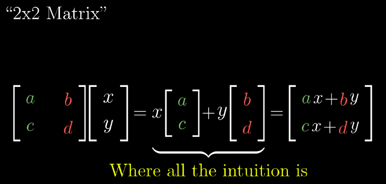

## Change the 「basis」

> `Changing basis` is the very core of Linear Transformation. Every single move is based on this.

Remember a vector `(a, b)` could also present in `unit vector` form as `v = ai + bj`,
and unit vectors are `i = (1, 0) & j = (0, 1)`.

If we want to transform a vector, like `move, flip, rotate, scale`, the thing we'll do is:
**TO CHANGE THE UNIT VECTOR `i` AND `j`**.

For example, there's a vector `v = (-1, 2)`, and it can present as `v = -1i + 2j`, then we're to do some movement to it:
- Move: We let unit vector `i = (100, 0)`, then the vector moves to the right becomes `(-100, 2)`.
- Rotate: we let unit vector `i = (0, 1)` and `j = (-1, 0)`, then the vector rotates 90° becomes `(-2, -1)`.
**THAT'S THE MAGIC!!**

By telling where the `unit vectors` are to go, we can create a pattern, a mapping rule, so that every vector uses this map, this rule, this pattern will have the same transformation!

Another example: 
Assume there's a vector `v=(5,7)`, and let the unit vector `i=(3,-2)` and `j=(2,1)`, and present this **`TRANSFORM PATTERN`** as below:
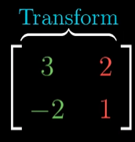

And we present this `Applying a transformation to a vector` in the form below:
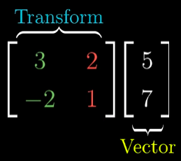

**SO WHENEVER YOU ENCOUNTER MATRIX MULTIPLICATION AGAIN, NEVER READ IT AS TWO VECTORS OR TWO MATRICES MULTIPLYING TOGETHER!**

## How to interpret a 「Matrix Multiplication」

There're only TWO part of this matrix multiplication:
- `The Graph`: the 1st on right item.
- `The Rules`: All the rest Matrices on the left of `The Graph`.

`The Graph` could be one point (vector) or many points (vectors), e.g.:
- A point: `(2,3)`
- A triangle: `[ (3,0)   (0,4)   (3,4) ]`
- A rectangle: `[ (3,0)   (3,4)    (0,4)  (0,0)]`
- Any shape in any dimension.....

SO ALL YOU NEED TO DO, IS JUST TO APPLY THOSE RULES ONE BY ONE, `LEFT BY RIGHT`, AND GET A NEW GRAPH!!!

For example, we apply two transform rules to a vector `(x, y)`:

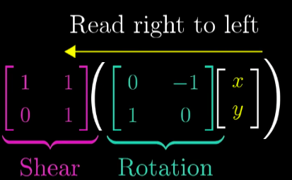

It's exactly same with the function principles: `Shear( Rotate(x, y) )`.

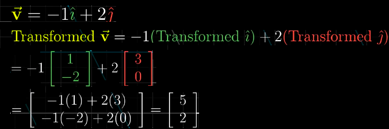

## Break up the Matrices with its 「Geometric」 meaning

In the `transform rule` as below:
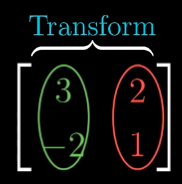

**WE HAVE TO BREAK THE MATRICES INTO SINGLE PARTS BEFORE WE DO THE CALCULATION.** 

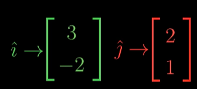

And since we made the rule for `i & j`, so let's apply the `unit vector` to `the Graph`:
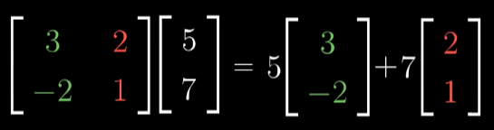

Note that: 
- The original graph is `v = 5i + 7j`, so after applying the new rule of `i & j`, we get: 
`v = 5(3,-2) + 7(2,1)`
- And now we could do the `Vector multiply a scalar` method, to get this:
`v = (15,-10) + (14,7)`
- Then we could do `Add two vectors`:
`v = (19, -3)`
- So after applying the transformation rule, we successfully transformed the vector to a new position:
 `(19, -3)`

### Example
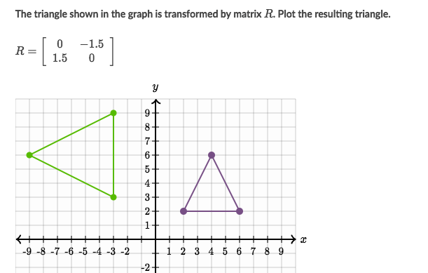
Solve:
- It seems a `Matrix Multiplication` problem
- First we need to form the original matrix by identifying all vertices:
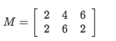
- Transform the matrix by multiplying the `Coordinate Matrix`:
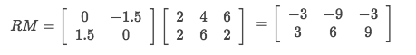
- Draw it out by the result matrix

