# ❖ Matrix Transformation

> It's a subset of `Linear transformation`, just with `higher dimension rules` & `multiple points graph` multiplying together. 

**YOU BREAK `THE RULE` IN TO DIFFERENT UNIT VECTORS i, j, k... AND BREAK THE GRAPH INTO DIFFERENT POINTS, AND APPLY EACH i, j, k RULES TO EACH POINT.**

## 「Size」 of Matrix multiplication

Unlike `Vector multiplication` gives you only a number, `Matrix multiplication` gives you another `Matrix`, but a **SHRINK-SIZED** Matrix.
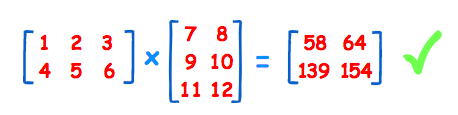

In General:
To multiply an `m×n matrix` by an `n×p matrix`, the `n`s must be the same, 
and the **RESULT** is an `m×p matrix`.

### Example: 「3x2 Matrix」 with 「2x2 Matrix」
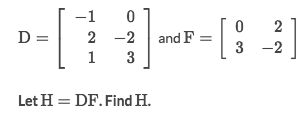
Solve:
- First we know it's a 3x2 Matrix multiply a 2x2 Matrix, it's valid, and the new Matrix's size would be 3x2.
- And then we multiply each by each according to their **dimension**:
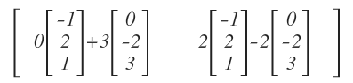
- We get the answer:
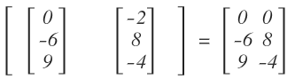

### Example: 2x2 Matrix with 2x3 Matrix
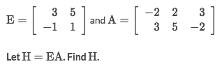
Solve:
- It's will get a 2x3 new Matrix (just for intuition), then we get the answer:
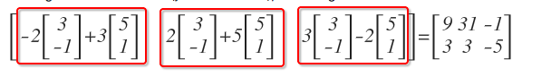

### More examples

Refer to [Symbolab the Online math solver](https://www.symbolab.com/solver/matrix-vector-calculator/%5Cbegin%7Bpmatrix%7D-1%5C%5C%204%5C%5C%204%5Cend%7Bpmatrix%7D%5Ccdot%5Cbegin%7Bpmatrix%7D0%26-2%5Cend%7Bpmatrix%7D), which offers answers of any matrices operation step by step.

## Common Matrix Transformations

> One single matrix to present the movement? Yes!

[Refer to Math planet: Transformation using matrices](https://www.mathplanet.com/education/geometry/transformations/transformation-using-matrices)

## 「Rotation」 of Shapes

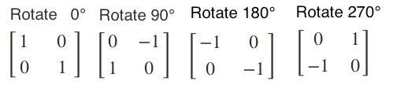

[`▶ Use the tool: Desmos Matrix Calculator`](https://www.desmos.com/matrix)

### Example: Transform Graphs
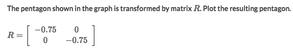
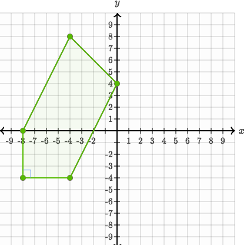
Solve:
- Just to list all points of this graph:
`(-4,8), (-8,-4), (-4,-4), (0,4)`
- Arrange points to a Matrix:
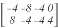
- Apply the Matrix R to the Graph's matrix. Do the math.

### 「Reflection」 of Shapes

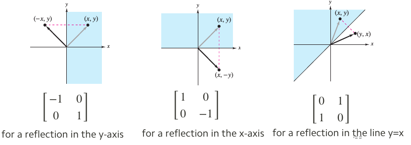
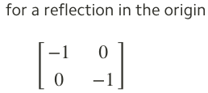

