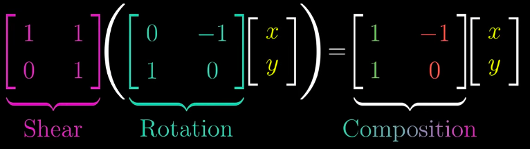
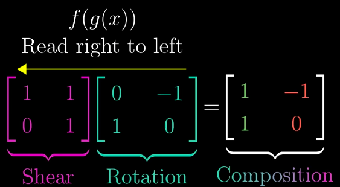
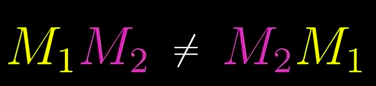

# Composition of Matrix Multiplication

> `Composition of Matrix Multiplication` means **More than one linear transformations applies to a graph one by one.**

**Although you can see two matrices multiplying together as `a transform applying to a graph`.
But actually sometime you can see it in slightly different perspective.**

[Refer to 3Blue1Brown: Matrix multiplication as composition](https://www.youtube.com/watch?v=XkY2DOUCWMU&list=PLZHQObOWTQDPD3MizzM2xVFitgF8hE_ab&index=5)

So extend from the equation above, we know that the `transformation rules` could **Unite together as one** and then apply it to `the graph`.
And here it comes, **MATRICES MULTIPLICATION COULD ALSO REPRESENT TRANSFORM RULES UNITE TOGETHER AS A RESULT RULE, RATHER THAN ONE RULE WORK ON A GRAPH.**

## Order matters!

