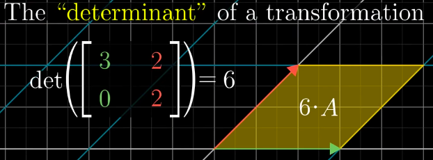
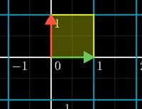
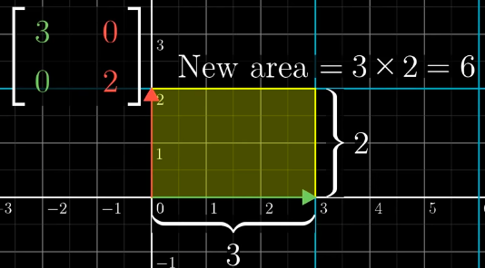
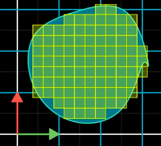
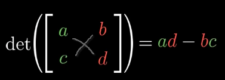
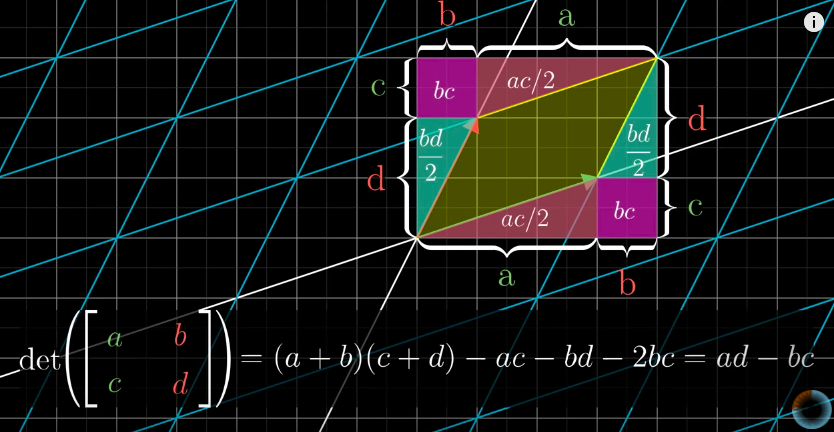
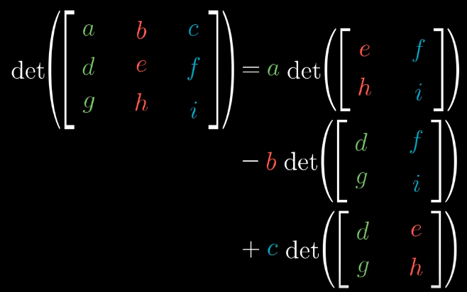
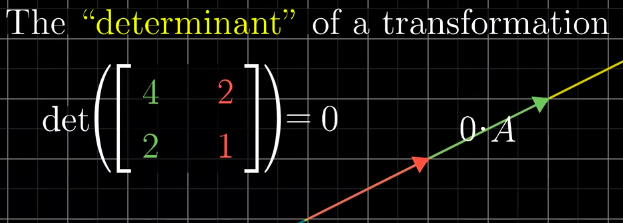
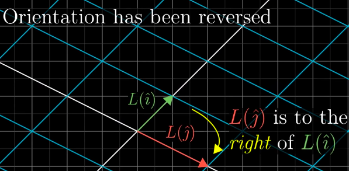

# ❖ Determinant of Transformation

It's quite easy to calculate, and not too hard to understand what's behind it.
> The `Determinant of a transformation` is **How much the AREA of the new Graph scaled.**

**JUST TO REMEMBER: THE DETERMINANT IS ABOUT AREA OF THE GRAPH!**

[Refer to 3Blue1Brown: The determinant](https://www.youtube.com/watch?v=Ip3X9LOh2dk&index=7&list=PLZHQObOWTQDPD3MizzM2xVFitgF8hE_ab&t=0s)

### 「Unit vector」 graph

We all know the `unit vector i & j`  made an area of `1`.
But when we do a `Linear transformation` to the `unit vector graph`, the area is not `1` anymore, might be bigger or smaller. 
So how much it re-sized we call it the `determinant`.

Note that:
- Since `a/1 = a`, so calculating the **Area** of the `new unit vector graph`, is equal to the scalar itself.
- Calculating how much the `unit vector graph` scaled, is exactly equal to how much the whole graph scaled.

## Irregular shape

> If it's not a `grid square` can be approximately very well  by many many `small piece of grid squares`.

## 「Determinant formula」 for 2x2 Matrix

[Refer to Khan video.](https://www.khanacademy.org/math/precalculus/precalc-matrices/modal/v/finding-the-determinant-of-a-2x2-matrix)

> It will be so much easier if you just to memorise the formula, than to understand where it comes from, which is also not necessary to do.

## 「Determinant formula」 for 3x3 Matrix

> I hope you're not gonna have chance to apply this formula.

> "This (determinant) is both tricky to show and derive, and is kind of **pointless**. Knowing how to do the operations (of determinant) **isn't a useful skill anymore** because we just type **det(A)** into a computer. Thus I'll just type det(A) and my computer gives me the answer, done. From a learning perspective, it doesn't add much. So I'm not going to teach you how to do determinants. If you want to know, then look up a **QR decomposition** online, or better yet, look in a linear algebra textbook." -  David Dye, Imperial College London

## 「Zero determinant」

If the determinant of a transformation `det(M) = 0`, then it means the Transformation squishes the graph to a line or a point!

## 「Negative determinant」

A `negative determinant` means the graph has been **`flipped over`** by the transformation. 
Then the `j unit vector` flip over to the **LEFT** side of `i unit vector`.

[Refer to 3Blue1Brown for visualisation](https://youtu.be/Ip3X9LOh2dk?t=3m46s)

