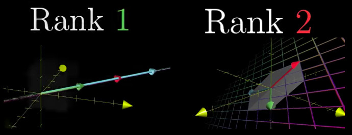

# Rank of Transformation

Means the `Dimension of output of a transformation`.

[Refer to 3Blue1Brown: Inverse matrices, column space and null space](https://youtu.be/uQhTuRlWMxw?t=8m)

After doing a transformation to a graph, it is:
- Rank 1: if the output of the graph is 1-Dimensional, which is a line.
- Rank 2: if the output of the graph is 2-Dimensional, which is a plane.
- Rank 3: .....

In the case of 2x2 Matrices, the `Rank 2` is the best it can be.
In the case of 3x3 Matrices, the `Rank 2` means it collapsed, or dimensional reduced.

When it's the highest rank the Matrix can be, we call it **`THE FULL RANK`**.

