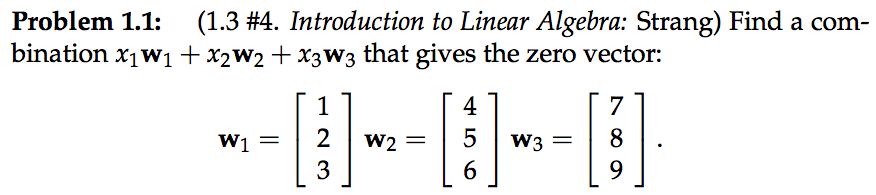
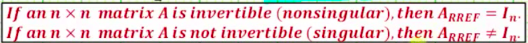
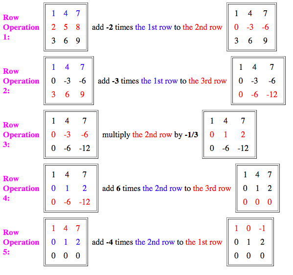

# Solving 「System of Linear Equations」[DRAFT]

## 「Row Echelon Form」

And at this point, `x₁(1,0,0) + x₂(0,1,0) + x₃(-1,2,0) = (0,0,0)`. So for what coefficients of `x₁, x₂, x₃` would produce a zero vector? By eyeballing it we could tell, `x₁=1 & x₂=-2` would have done.

