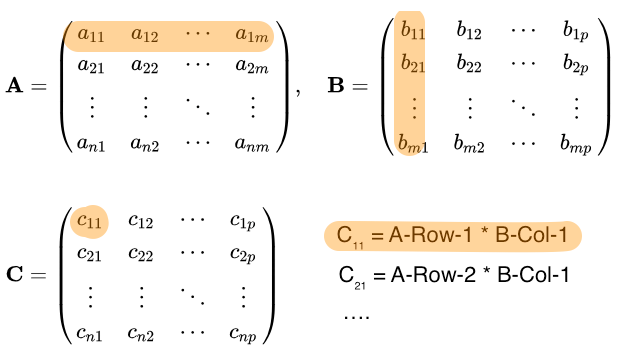
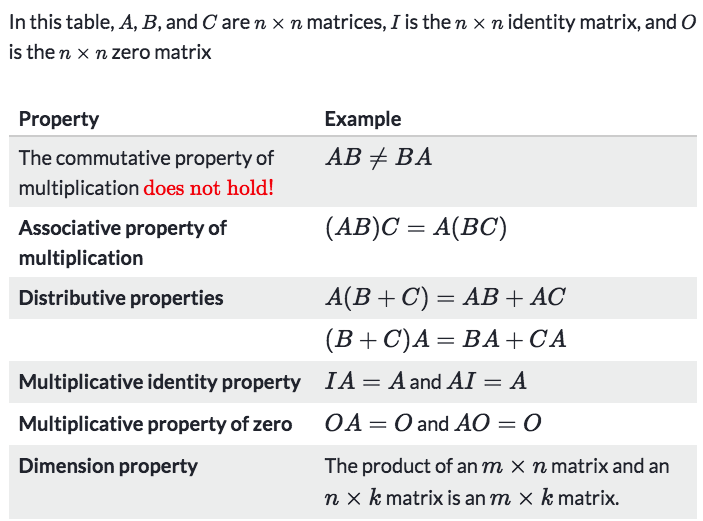
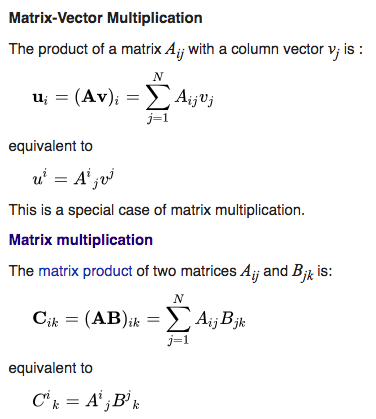

# ❖ Matrix Multiplication

[Refer to this video by mathispower4u](https://www.youtube.com/watch?v=zAjUyPe-4mI&feature=youtu.be)

Practice:
- [ ] [Khan academy (simple)](https://www.khanacademy.org/math/precalculus/precalc-matrices/multiplying-matrices-by-matrices/e/multiplying_a_matrix_by_a_matrix)
- [ ] [Symbolab (simple/advanced)](https://www.symbolab.com/practice/matrices-practice#area=main&subtopic=Multiply&isTour=false)
- [ ] [Wolfram (beginner/Intermediate/Advanced)](https://www.wolframalpha.com/problem-generator/quiz/?category=Linear%20algebra&topic=MultiplyNMatrices)
- [ ] [UOS](http://www.maths.usyd.edu.au/u/UG/JM/MATH1002/Quizzes/quiz7.html)

A fairly simple way to remember how to do `matrix multiplication`:
Assume that two matrices multiply together as `AB = C`.
**You need to write out each entries of the product, and then place this entry with a row of A and a column of B which numbered as subscriptions of this entry.**
e.g., in the `Product Matrix`, C₁₁ represents `Row-1 of A multiplies Column-1 of B`;
C₂₁ represents `Row-2 of A multiplies Column-1 of B`.
So on and so forth, write down all the **entries** of the product entries, and then use `dot product` to calculate each one. 

## 「Properties」 of matrix multiplication

[Refer to Khan academy article.](https://www.khanacademy.org/math/algebra-home/alg-matrices/modal/a/properties-of-matrix-multiplication)

## 「Einstein summation」 convention

[Refer to Wiki: Einstein notation](https://en.wikipedia.org/wiki/Einstein_notation)

