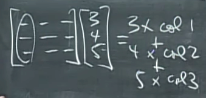
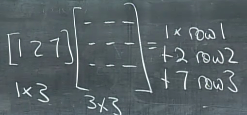
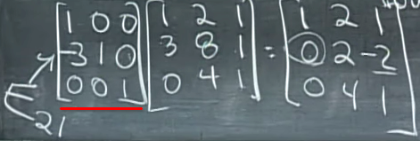
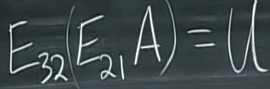
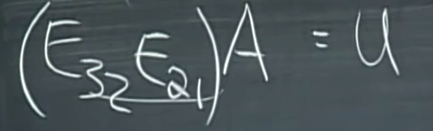
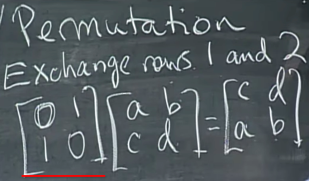
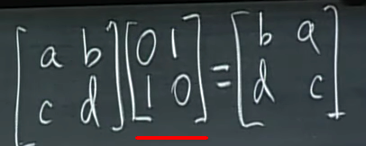
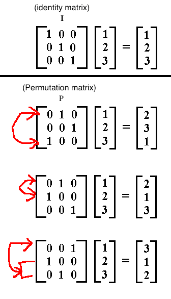

# MIT OCW 18.06 SC Unit 1.2 Elimination with Matrices
> `Elimination` is the method **EVERY** softwares use to solve `linear equations`.

prerequisites:
- Terminology(Augmented matrix, elementary matrix, pivot, gauss elimination...), included in [this note](https://github.com/solomonxie/solomonxie.github.io/issues/40#issuecomment-383020020).
- Matrix elimination, review [this note](https://github.com/solomonxie/solomonxie.github.io/issues/40#issuecomment-383020020).
- Gauss elimination, review in simple wiki.

Lecture video timeline | Links
-- | -- 
Lecture | [0:00](https://www.youtube.com/watch?v=QVKj3LADCnA&t=0s&index=2&list=PLE7DDD91010BC51F8)
Elimination pivots and an example | [3:09](https://youtu.be/QVKj3LADCnA?t=3m9s) 
Failure of Elimination method | [10:34](https://youtu.be/QVKj3LADCnA?t=10m34s) 
Augmented matrix | [14:50](https://youtu.be/QVKj3LADCnA?t=14m50s)
Operations of matrices elimination | [19:24](https://youtu.be/QVKj3LADCnA?t=19m24s)
Row operations of Matrices Multiplication | [20:22](https://youtu.be/QVKj3LADCnA?t=20m22s)
Column operations of Matrices multiplication | [21:43](https://youtu.be/QVKj3LADCnA?t=21m43s)
Elementary Matrix | [24:46](https://youtu.be/QVKj3LADCnA?t=24m46s)
Include all elimination steps in one Matrix | [33:29](https://youtu.be/QVKj3LADCnA?t=33m29s)

> To do `column operations`, the matrix multiplies on the right. To do `row operations`, the matrix multiplies on the left.

## 「Column operation」 of Matrices Multiplication

> Below it's a `Column Vector multiplied by a 3x3 Matrix`:

The result  above is a `3x1 Matrix`, which is a `Column vector` again. Because:

**THE RESULT OF THAT COLUMN OPERATION IS A LINEAR COMBINATIONS OF THE COLUMNS.**

> **"A MATRIX TIMES A COLUMN, IS A COLUMN."**

## 「Row operation」 of Matrices Multiplication

> Below it's a `Row Vector to multiply a 3x3 Matrix`:

The result above is a `1x3 Matrix`, which is a `Row vector` again. Because:

**THE RESULT OF THAT ROW OPERATION IS A COMBINATION OF THE ROWS.**

## 「Elementary Matrix」

> It's also called `Elimination Matrix`.

[Refer to this amazing good video by Mathispower4u: Elementary Matrices](https://www.youtube.com/watch?v=7H3JFH3IjB0&feature=youtu.be)
[Refer to Mathispower4u: Write a Matrix as a Product of Elementary Matrices](https://www.youtube.com/watch?v=pMp8RfWtPwQ&feature=youtu.be)

Simply saying, an `Elementary Matrix` is just an `Identity Matrix` with **ONLY ONE ELEMENT CHANGED**.

`Elementary Matrix` must be **ONLY ONE ROW OPERATION** away from the `Identity Matrix`.

The example above is an `elementary matrix` which only altered the `Row-2 Column-1 entry`, and we'd like to call it the `E₂₁ matrix`, which represents `the elementary matrix which fixed the 2-1 position`.

The reason we need an `elementary matrix` is to apply each one step of `Elimination of linear equations`.
Which means that, 

**FOR EVERY SINGLE STEP OF ELIMINATION, WE NEED AN ELEMENTARY MATRIX.**

So for **two steps of elimination**, we could represent it with `elementary matrices` as below:

Combining **all elimination steps** in ONE MATRIX:

## 「Permutation Matrix」

> `Permutation Matrix` is **ANOTHER TYPE OF ELEMENTARY MATRIX**, and used only to **switch positions** of elements in the matrix, without changing any numbers.

Review [Dr. Strang's lecture](https://www.youtube.com/watch?v=QVKj3LADCnA&feature=youtu.be&t=36m42s).

Example: To **switch two ROWS of a matrix** by using a `permutation matrix` :

Example: To **switch two COLUMNS of a matrix** by using a `permutation matrix`:

### Some common 「permutation matrices」

