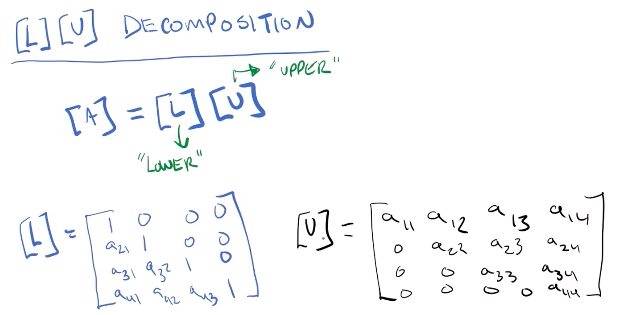
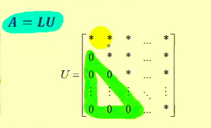
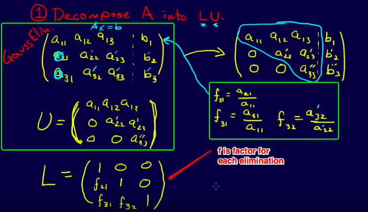
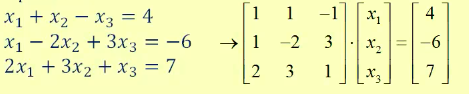
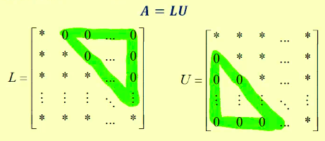
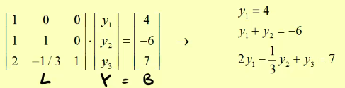
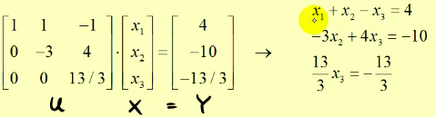

# LU Decomposition [DRAFT]

For a Matrix A, we could factor it out as `A = LU`, just like we factor a number to two numbers.

[`Online LU Decomposition Calculator`](https://www.wolframalpha.com/input/?i=LU+decomposition+of+%7B%7B7,3,-11%7D,%7B-6,7,10%7D,%7B-11,2,-2%7D%7D&lk=3)

## 「Upper Triangular Matrix」

The factor matrix `U` represents the `Upper Triangular Matrix`, which we're already familiar with: the matrix we've got after `Gauss Elimination`.

Refer to video:[ LU Decomposition using Gaussian Elimination](https://www.youtube.com/watch?v=jbeX2HCW6OE)

## 「Lower Triangular Matrix」

The factor matrix `L` is not hard to get as well: 
**All the numbers in this matrix are `factor numbers` we used in each elimination step.**

### How to get the 「Lower Triangular Matrix」

[Refer to this video: LU Decomposition - Shortcut Method by Math is power](https://www.youtube.com/watch?v=UlWcofkUDDU)

## Solve 「System of equations」 using 「LU Decomposition」

> The final **goal** of learning `LU Decomposition` is to **solve Linear systems**.

[Refer to this video: Solve a System of Linear Equations Using LU Decomposition](https://www.youtube.com/watch?v=m3EojSAgIao&feature=youtu.be)

Assume there's equation `AX = B` as below, and we're to solve for `X`: 

Steps to apply the `LU Decomposition` to solve the Linear System:
- Decompose LU, and represent `AX = B` as `LUX = B`

- Let `Y = UX`, then solve `LY = B` for `Y`

- Solve `Y = UX` for `X`

