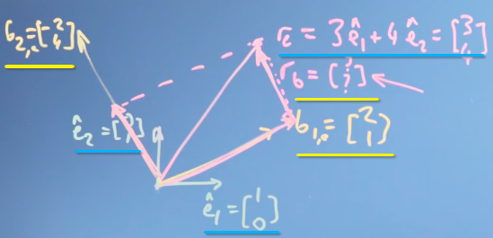
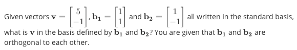
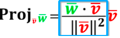
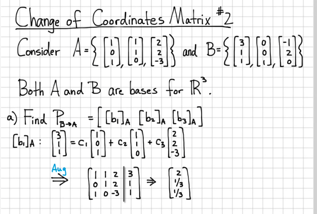

# ❖ Change of basis

> Changing basis of a vector, the vector's length & direction remain the same, but the numbers represent the vector will change, since the meaning of the numbers have changed. 
Our goal is to calculate the New numbers in the vector in terms of the new basis.

[Refer to video by Trefor Bazett: Deriving the Change-of-Basis formula](https://www.youtube.com/watch?v=njvTyIWtxrE)

## 「Projection vector method」 (Only for 90° bases)

> The goal is to write a vector in a new basis.

[Refer to lecture form Imperial College London: Changing basis](https://www.coursera.org/learn/linear-algebra-machine-learning/lecture/AN3cB/changing-basis)



Remember the `Projection 

Just to save some words, here's the example and solution:

Example:

Solution:
The idea is to take projection of the vector onto both **new basis**, except it's taking only a part of the `projection vector formula`. As in the formula below, it only takes the blue squared part as the number of the new vector's component.

```py
Component V₁ = (V﹒b₁) / |b₁|² = (5*1 + -1*1) / ( √(1²+1²) )² = 4/2 = 2
Component V₂ = (V﹒b₂) / |b₂|² = (5*1 + -1*-1) / ( √(1²+(-1)²) )² = 6/2= 3

V' = (2, 3)
```

## Matrices 「changing basis」

[Refer to lecture: Matrices changing basis](https://www.coursera.org/learn/linear-algebra-machine-learning/lecture/q8iik/matrices-changing-basis)
[Refer to video: Change of Coordinates Matrix #2](https://www.youtube.com/watch?v=2K6ipONMIgg&t=24s)



