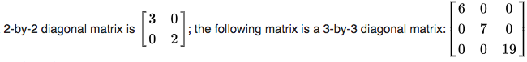
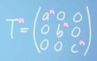
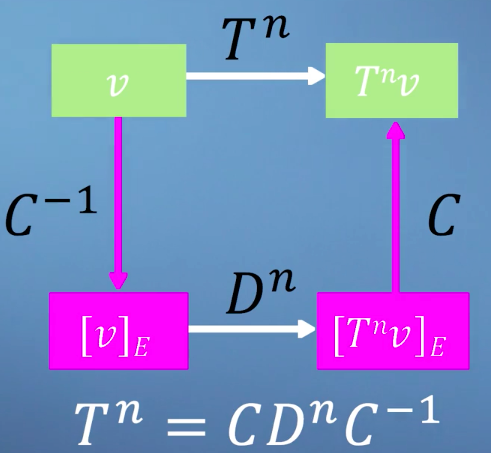

# ❖ Eigen-stuffs [DRAFT]

## 「Eigenvectors」

> For a `linear transformation`, an `eigenvector` is a vector which, after applying the transformation, stays in the **same span**. 

When we say `eigenvectors`, we always need to say `eigenvectors of a linear transformation`.
It's the same with `determinant of linear transformation`.

### How to calculate the Eigenvectors

## 「Eigenvalues」

## 「Diagonal Matrix」

> A `diagonal matrix` is a matrix in which the entries outside the `main diagonal` are all zero.

Imagine we are applying a Transformation matrix many many times, if we follow the basic Matrix Multiplication rule that will be a shit ton of calculations. But `Diagonal matrix` rule save us out.

## 「Eigenbasis」 & 「Diagonalization」

[Refer to lecture: Changing to the eigenbasis](https://www.coursera.org/learn/linear-algebra-machine-learning/lecture/EcsN0/changing-to-the-eigenbasis)

If you're lucky enough, that the `Transformation Matrix` is a `Diagonal matrix`, 
then when you're raising powers to the Matrix, you just need to simply raise power to the `Diagonal elements`.

If you aren't lucky, that the Transformation Matrix isn't a Diagonal matrix, 
then we're gonna do `Eigen-Analysis`, 
which means:
1. we're to change our basis to make the Transformation Matrix to a Diagonal matrix, 
2. then raise power to it, 
3. finally transform the result matrix back to original basis again.

The steps will be like:

