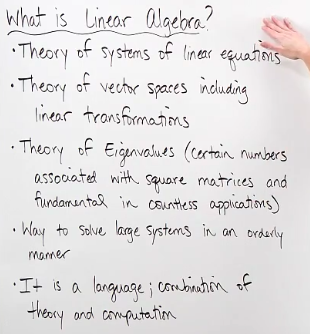
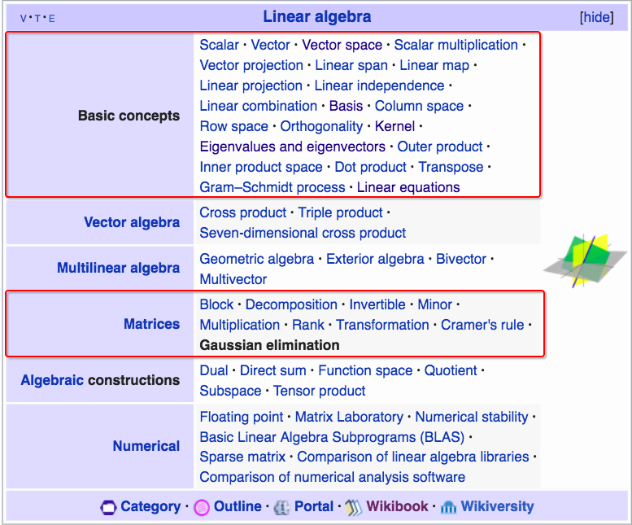
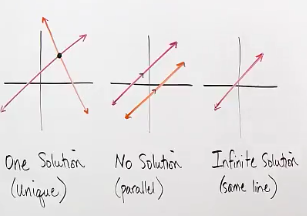
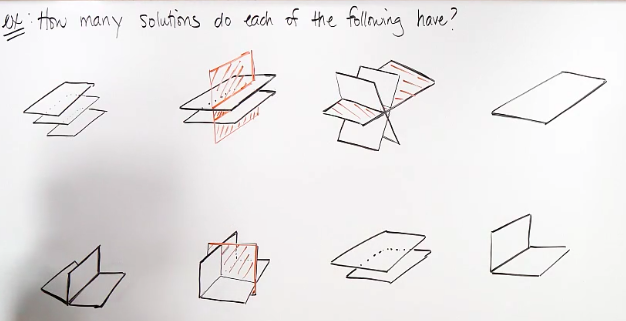

# What is Linear Algebra

Linear algebra, Matrix algebra, same thing.

## Terms sheet

## Consistent & Inconsistant

> If there IS solution or solutions to a `Linear system`, then it's consistent. Otherwise, it's Inconsistent.

