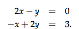
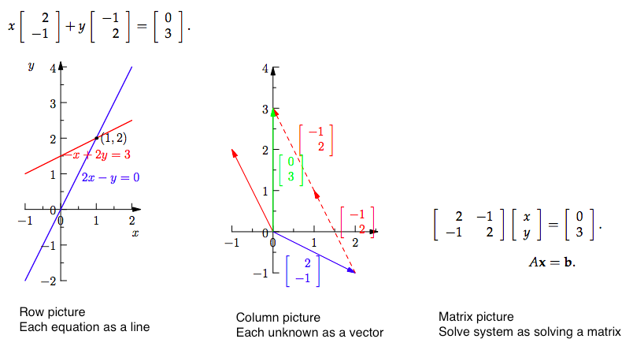

# MIT OCW 18.06 SC Unit 1.1 The geometry of linear equations

[Refer to the review pdf.](https://ocw.mit.edu/courses/mathematics/18-06sc-linear-algebra-fall-2011/ax-b-and-the-four-subspaces/the-geometry-of-linear-equations/MIT18_06SCF11_Ses1.1sum.pdf)

Lecture video timeline | Links
-- | --
Lecture | [0:00](https://www.youtube.com/watch?v=ZK3O402wf1c&t=0s&index=1&list=PLE7DDD91010BC51F8)
Matrix picture | [2:47](https://youtu.be/ZK3O402wf1c?t=2m47s)
Row picture | [3:41](https://youtu.be/ZK3O402wf1c?t=3m41s)
Column picture | [8:41](https://youtu.be/ZK3O402wf1c?t=8m41s)
Matrix picture in 3D | [15:26](https://youtu.be/ZK3O402wf1c?t=15m26s)
Row picture in 3D: intersects of planes | [17:33](https://youtu.be/ZK3O402wf1c?t=17m33s)
Column picture in 3D | [23:11](https://youtu.be/ZK3O402wf1c?t=23m11s)
Permutation Matrix | [36:42](https://youtu.be/QVKj3LADCnA?t=36m42s)

> "The fundamental problem of linear algebra is to solve n linear equations in `n` unknowns."

We view this problem in three ways:
- `Row picture`: Each row is an equation, and we could draw out each line equation on the graph.
- **`Column picture`**: Rewrite equations in the form below, and each column is a vector, and we could each vector (with scalar) on the graph.
- `Matrix picture`: Rewrite equations into `Coefficient Matrix form`, and see the geometric meaning of a matrix and vector.

