# Matrices Elimination

> `Matrices elimination` (or `solving system of linear equations`) is the very first and fundamental skill throughout Linear Algebra. It's probably the first lesson of all sorts of courses.

## Terminology

Before learning `solving systems of linear equations`, you really need to get familiar with all the core terminologies involved, otherwise it can be very hard to move on to next stage.
And in this case, the best way to learn that is through Wikipedia.

JFR, the core terms are: `Gaussian elimination`, `Gauss-Jordan elimination`, `Augmented Matrix`, `Elementary Row Operations`, `Elementary matrix`, `Row Echelon Form (REF)`, `Reduced Row Echelon Form (RREF)`, `Triangular Form`.

## 「Gaussian elimination」

[Refer to wiki: `Gaussian elimination`](https://en.wikipedia.org/wiki/Gaussian_elimination)

> It's a `Row reduction algorithm` to solve System of linear equations.

[Refer to simple wiki: Gaussian elimination](https://simple.wikipedia.org/wiki/Gaussian_elimination)
[Example: showme.com](http://www.showme.com/sh/?h=3fjkVEW)

To perform `Gaussian elimination`, the `coefficients of the terms in the system of linear equations` are used to create a type of matrix called an `augmented matrix`. 
Then, `elementary row operations` are used to **simplify** the matrix. 
The **goal** of Gaussian elimination is to get the matrix in `row-echelon form`. 
If a matrix is in `row-echelon form`, which is also called `Triangular Form`.
Some definitions of Gaussian elimination say that the matrix result has to be in `reduced row-echelon form`. 
**Gaussian elimination that creates a reduced row-echelon matrix result is sometimes called `Gauss-Jordan elimination`.**

To be simpler, here is the structure:
- Algorithm: `Gaussian Elimination`
    - Step 1: Rewrite system to a `Augmented Matrix`.
    - Step 2: Simplify matrix with `Elementary row operations`.
    - Result:
        - `Row Echelon Form` or
        - `Reduced Echelon Form`

And if we make the result only in `RREF`, so the name of the algorithm could also be called:
- Algorithm: `Gauss-Jordan Elimination`
    - Step 1: Rewrite system to a `Augmented Matrix`.
    - Step 2: Simplify matrix with `Elementary row operations`.
    - Result: Only in `Reduced Echelon Form`

### 「Elementary Row Operations」

Elementary row operations are used to **simplify the matrix**. 

The three types of row operations used are:
- Type 1: **Switching** one row with another **row**.
- Type 2: **Multiplying** a row by a non-zero **number**.
- Type 3: **Adding** a row from another **row**. (!Note: you can only **ADD** them but not **subtract**, but you can **ADD** a negative)

Confusing operation: See where the `negative sign` was put:
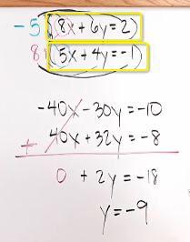

### Example
Suppose the goal is to find the solution for the linear system below:
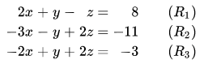

First we need to turn it into `Augmented Matrix` form:
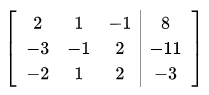

Then we apply `Elementary Row Operations`, and result in `Row Echelon Form`:
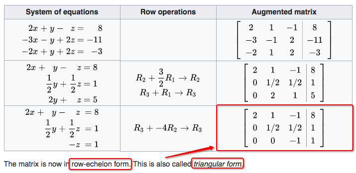

At the end, if we'd like, we can further on apply some row operations to get the matrix in `Reduced Row Echelon Form`:
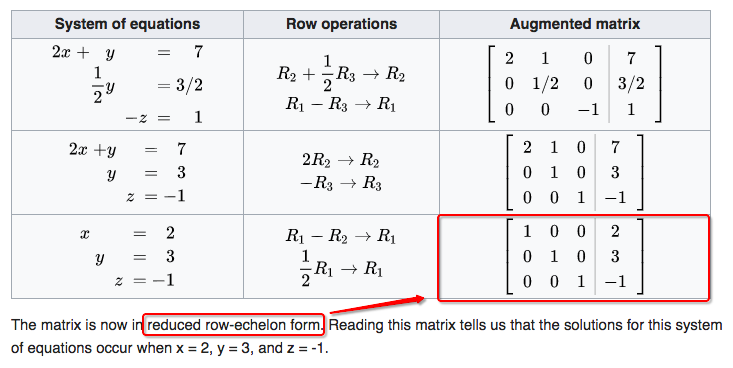
Reading this matrix tells us that the solutions for this system of equations occur when x = 2, y = 3, and z = -1.

### 「Row Echelon Form」 vs. 「Reduced Row Echelon Form」

[Refer to this lecture video: REF & RREF](https://www.youtube.com/watch?v=W01H0LcVUdQ&index=10&list=PLHXZ9OQGMqxfUl0tcqPNTJsb7R6BqSLo6).

It doesn't really matter it is a `Square Matrix` or not, there could be a `Diagonal` or `Main diagonal`, or you can't draw a diagonal at all. 
The only thing matters is **WHAT ARE ABOVE 1 AND WHAT ARE BELOW 1.**

- REF: For each column, all numbers **below** 1 MUST BE 0. Doesn't matter what numbers are above 1.
- RREF: For each column, all numbers both **above & below** 1 MUST BE 0. We don't care about it if there's no 1 in the column.

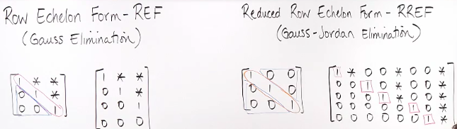

## 「Augmented Matrix」

> Means we put another column into the matrix, which represents the **Right side** of the system of equations, numbers of right of the `=` sign.

When we apply elimination to `Linear equations`, we operate both sides at the same time. But for computer programmes, it often apply to **Left side**, and remember the operations, a.g. multiply a number or add equations together, when the left side finished then apply the same operations to the right side.

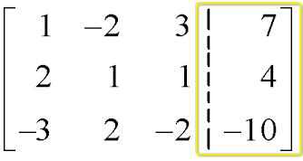

If a given Matrix was told it's an `Augmented Matrix`, so we have to assume that the **Last Column** is **The Solution Column**.

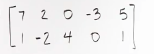

## 「Equivalent systems」 & 「Equivalent Matrices」

- Equivalent systems: Linear systems with the SAME SOLUTION SET.
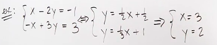
- Equivalent matrices: Two matrices where One Matrix **can be turned** into the other matrix by some `elementary row operations`.
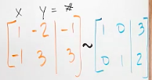

## 「Pivot」

> Or called the `Cursor`, or `Basic`, or `Basic variable`.

[Refer to this video from mathispower4u.](http://youtu.be/HFbBclH99d0)

It means the value that represents the `unknown variable`  in each column. There's no `pivot` in a column if you can't get a 1 in that column.

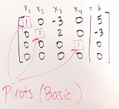

### 「Free variables」

If there's no pivot in a column, that means this `unknown variable` of the column can be **any number**, so we call it a `free variable`.

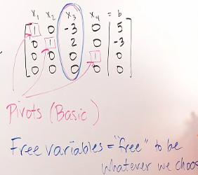

### `Pivot columns`

The `pivots` are found after `Row Reduction`, and then **go back** to the Original Matrix, the columns **WITH** pivots are called `pivot columns`.

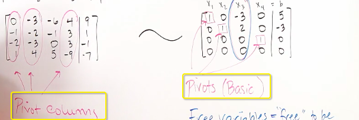

### 「Back substitution」

It's simple: When you solve out one `unknown variable` in the Linear System, you put the value back to other equations. We call this process as `Back Substitution`.

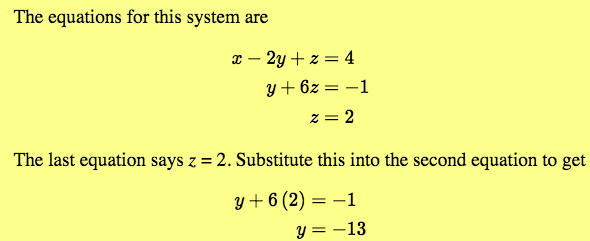

