# MIT OCW 18.06 SC  Unit 1.3 Multiplication & Inverse Matrices

Prerequisites | Links
-- | --
Matrix multiplication basics(row * col) | [Note](https://github.com/solomonxie/solomonxie.github.io/issues/40#issuecomment-386033645)
Elementary matrices | [Video](https://www.youtube.com/watch?v=1SoU0BfhKaI&feature=youtu.be)

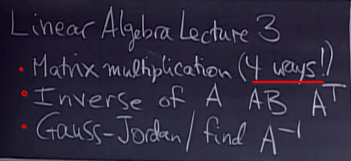

[Refer to Juanklopper's jupyter notebook.](https://github.com/solomonxie/jupyter-notebooks/blob/master/forks/MIT_OCW_Linear_Algebra_18_06-master/I_04_Matrix_multiplication_Inverses.ipynb)

Lecture timeline | Links
-- | --
Lecture | [0:0](https://www.youtube.com/watch?v=FX4C-JpTFgY&t=136s&index=3&list=PLE7DDD91010BC51F8)
Method 1: Multiply matrix by vector | [0:50](https://youtu.be/FX4C-JpTFgY?t=50s)
When allowed to multiply matrices | [4:38](https://youtu.be/FX4C-JpTFgY?t=4m38s)
Method 2: Multiply matrix by COLUMN | [6:12](https://youtu.be/FX4C-JpTFgY?t=6m12s)
Method 3: Multiply ROW by matrix | [10:04](https://youtu.be/FX4C-JpTFgY?t=10m4s)
Method 4: Multiply COLUMN by ROW | [11:37](https://youtu.be/FX4C-JpTFgY?t=11m37s)
Method 5: Block Multiplication | [18:25](https://youtu.be/FX4C-JpTFgY?t=18m25s)
Inverse Matrices (Square matrices) | [21:15](https://youtu.be/FX4C-JpTFgY?t=21m15s)
Invertible Matrix | [22:00](https://youtu.be/FX4C-JpTFgY?t=22m)
Singular Matrix (No-inverse matrix) | [24:39](https://youtu.be/FX4C-JpTFgY?t=24m39s)
Calculate Inverse of Matrix | [31:52](https://youtu.be/FX4C-JpTFgY?t=31m52s)
Gauss-Jordan Elimination to solve Inverse of a matrix | [35:20](https://youtu.be/FX4C-JpTFgY?t=35m20s)

## Method 1: Multiply 「matrix by vector」

Calculation of an entry of the Product Matrix.

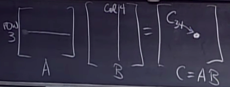

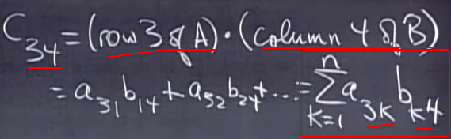

## Method 2: Multiply 「matrix by COLUMN」

Each **column** of the `product matrix C`, is `Matrix A * Column of B`.

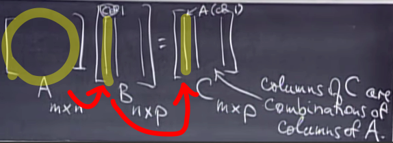

## Method 3: Multiply 「ROW by matrix」

Each **row** of the `product matrix C`, is `Row of A * Matrix B`.

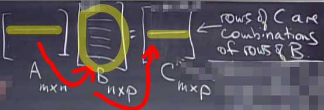

## Method 4: Multiply 「COLUMN by ROW」

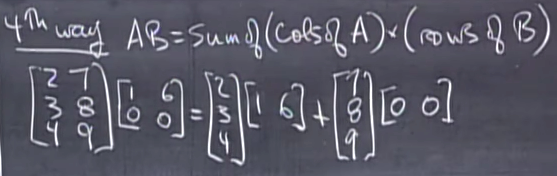

### 「Dot product」

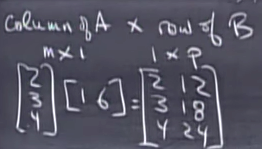

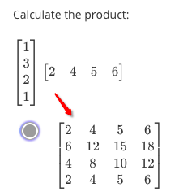

## Method 5: 「Block multiplication」

You can cut each matrix to blocks, each block is no necessary to be equal sized as long as they can match each other well.

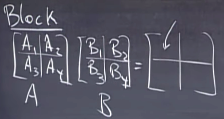

After you cut matrices into blocks, the multiplication will just be like a smaller matrix multiplication: **Each block can be seen as a number in a matrix.**

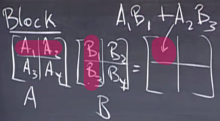

## 「Inverses」 (Square matrices)

If a matrix's inverse exists, then we call this matrix `Invertible`, or `Non-singular`.

And only with `square matrices`, the inverse can be both **right side** or **left side** with the original matrix to produce the `Identity Matrix`.

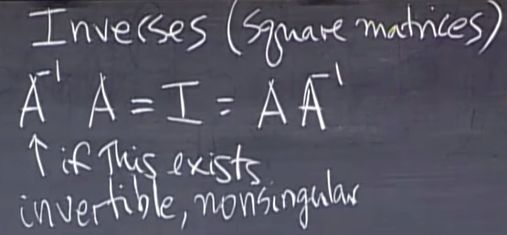

### 「Singular Matrix」 (No inverse)

Simplest way to tell if it's a `singular matrix` is to calculate its `Determinant` which we learnt in high school: It's a singular matrix if its determinant is ZERO.
But there's another way to tell:

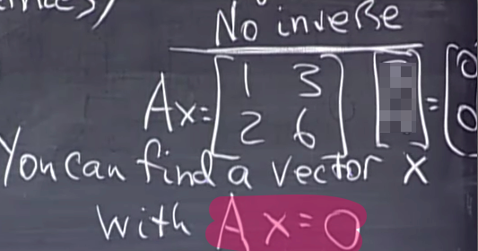

## Use 「Gauss-Jordan Elimination」 to get Inverse

**THIS METHOD IS SO MUCH EASIER TO GET THE INVERSE THAN THE WAY WE LEARNT IN HIGH SHCOOL WHICH LETS YOU TO CALCULATE ALL DETERMINANT, ADJUGATE AND COFACTOR AND SO ON.**

[Refer to Khan academy lecture: Inverting a 3x3 matrix using Gaussian elimination.](https://www.khanacademy.org/math/algebra-home/alg-matrices/alg-determinants-and-inverses-of-large-matrices/v/inverting-matrices-part-3)

[Online Calculator.](https://www.symbolab.com/solver/step-by-step/inverse%20%5Cbegin%7Bpmatrix%7D1%262%261%5C%5C%202%260%260%5C%5C%200%260%262%5Cend%7Bpmatrix%7D)

Practice for Gauss-Jordan Elimination to get Inverse of a matrix:
- [ ] [Khan academy](https://www.khanacademy.org/math/algebra-home/alg-matrices/alg-determinants-and-inverses-of-large-matrices/e/matrix_inverse_3x3)
- [ ] [Symbolab](https://www.symbolab.com/practice/matrices-practice#area=main&subtopic=Inverse&isTour=false)
- [ ] [Wolfram](https://www.wolframalpha.com/problem-generator/quiz/?category=Linear%20algebra&topic=Inverse2Matrix)
- [ ] [UOS](http://www.maths.usyd.edu.au/u/UG/JM/MATH1002/Quizzes/quiz8.html)

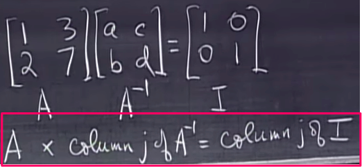

With this formula above, we got TWO equations, which will help us form a **system of equations**!
That's where Gauss comes in: we **AUGMENT TWO COLUMNS** to the matrix.

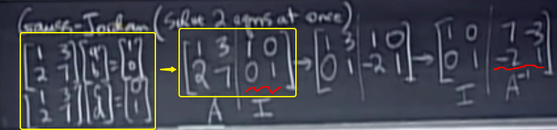

Why could we use Gauss-Jordan Elimination to solve `Inverse of matrix`?

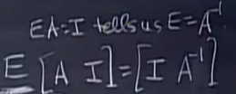

The `E` above represents `all elementary matrices`.

[Refer mathispower4uFor for refreshing on: How to get elementary matrices](https://www.youtube.com/watch?v=1SoU0BfhKaI&feature=youtu.be)

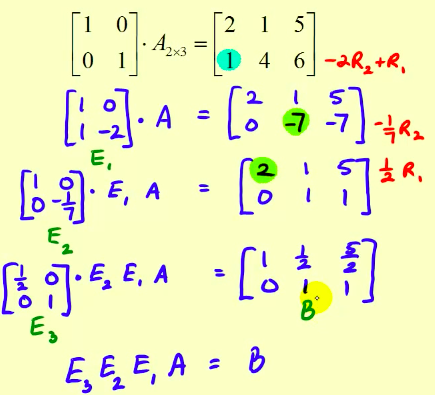

