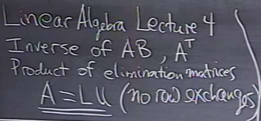
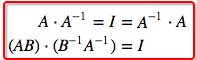
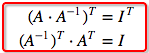
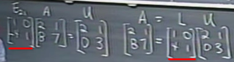
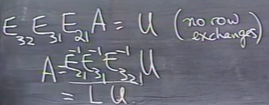
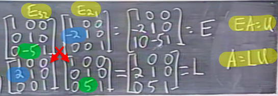
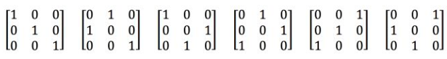
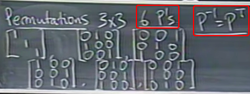

# MIT OCW 18.06 SC  Unit 1.4 Factorization into A = LU

Prerequisites
-- |
Matrix Inverses |
Matrix multiplication |
Elementary Matrix |
Permutation Matrix |




Lecture timeline | Links
-- | --
Lecture | [0:00](https://www.youtube.com/watch?v=MsIvs_6vC38&t=130s&index=4&list=PLE7DDD91010BC51F8)
What's the Inverse of a Product | [0:25](https://youtu.be/MsIvs_6vC38?t=25s)
Inverse of a Transposed Matrix | [4:02](https://youtu.be/MsIvs_6vC38?t=4m2s)
How's A related to U | [7:51](https://youtu.be/MsIvs_6vC38?t=7m51s)
3x3 LU Decomposition (without Row Exchange) | [13:53](https://youtu.be/MsIvs_6vC38?t=13m53s)
L is product of inverses | [16:45](https://youtu.be/MsIvs_6vC38?t=16m45s)
How expensive is Elimination | [26:05](https://youtu.be/MsIvs_6vC38?t=26m5s)
LU Decomposition (with Row exchange) | [40:18](https://youtu.be/MsIvs_6vC38?t=40m18s)
Permutations for Row exchanges | [41:15](https://youtu.be/MsIvs_6vC38?t=41m15s)


> "`A = LU` is the BIG FORMULA for elimination. It's a great way to look at Gaussian Elimination."

## What's the 「Inverse of a product」

Assume `A & B` are all invertible matrices, so what is `(AB)⁻¹`?

Yes, we multiply their inverses together `A⁻¹ & B⁻¹`, but in what order do we multiply these inverses?
**IN REVERSE ORDER.**
Which makes:
`(AB)(B⁻¹A⁻¹) = 𝐈` or `(B⁻¹A⁻¹)(AB) = 𝐈`. They perform in the same way get the same result.


so:

**`(AB)⁻¹ = (B⁻¹A⁻¹)`**


## Inverse of a 「Transposed Matrix」



So the Inverse of `(Aᵀ)⁻¹ = (A⁻¹)ᵀ`


## 「LU Decompose」 (without Row Exhcnage)

> "L is the product of Inverses."

**`L = E⁻¹`, which means L is the inverse of `elementary matrix`.**



Assume in the elimination process without row exchanges, we only apply `elementary matrices` to the matrix one by one.
So the `L` would be the **Inverse** of those elementary matrices, but in **Reverse order**.



```py
EA = U
A = LU
```



> So that steps above is the `Inverse Elementary Matrices` picture of getting the L. 
But actually what actually we get is really simple to observe:
**If no row exchanges, multipliers go directly into L.**

So as we've understood the meaning behind it, we can forget it and just remember the **`multipliers`**.


## Row exchanges with 「Permutations」

> For LU Decomposition, although we can't represent row exchanges with `Elementary Matrices`, but we can do it with `Permutation matrices`.

For a 3x3 Identity Matrix, there're 6 permutations of it:



**The `Inverse of a Permutation` is its `Transpose`**:



