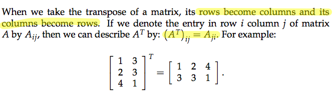
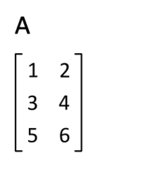
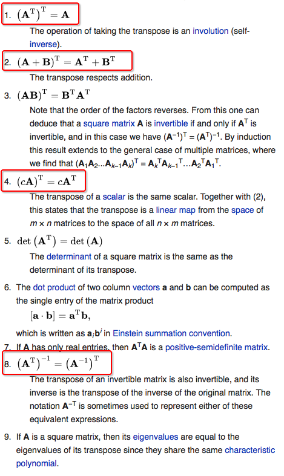
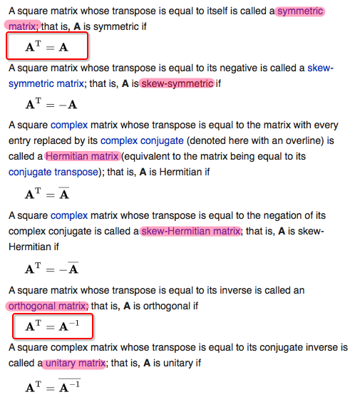
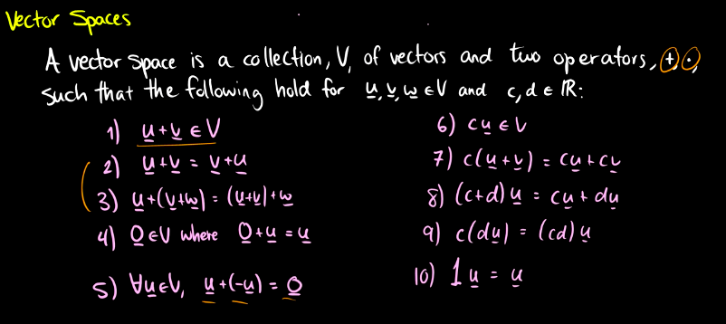
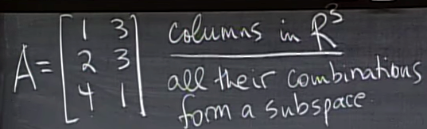
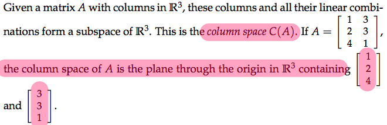

# MIT OCW 18.06 SC  Unit 1.5 Transposes, Permutations, Vector Spaces Rⁿ

Lecture timeline | Links
-- | --
Lecture | [0:00](https://www.youtube.com/watch?v=JibVXBElKL0&list=PLE7DDD91010BC51F8&index=5&t=0s)
Permutations | [1:17](https://youtu.be/JibVXBElKL0?t=1m17s)
Possibilities of permutations | [7:23](https://youtu.be/JibVXBElKL0?t=7m23s)
Transposes | [10:15](https://youtu.be/JibVXBElKL0?t=10m15s)
General formula for transpose | [11:38](https://youtu.be/JibVXBElKL0?t=11m38s)
Symmetric matrices | [12:43](https://youtu.be/JibVXBElKL0?t=12m43s)
RᵀR is always symmetric | [15:06](https://youtu.be/JibVXBElKL0?t=15m6s)
Chapter 3: Vector spaces | [20:12](https://youtu.be/JibVXBElKL0?t=20m12s)
What "space" means | [22:03](https://youtu.be/JibVXBElKL0?t=22m3s)
Why is Origin necessary in Vector spaces | [25:33](https://youtu.be/JibVXBElKL0?t=25m33s)
Most important thing about Vector space | [28:29](https://youtu.be/JibVXBElKL0?t=28m29s)
A case that's not a Vector space | [29:41](https://youtu.be/JibVXBElKL0?t=29m41s)
All possible subspaces in R² | [35:54](https://youtu.be/JibVXBElKL0?t=35m54s)
All possible subspaces in R³ | [39:04](https://youtu.be/JibVXBElKL0?t=39m4s)
Subspaces come out from Matrices: Column Space | [39:45](https://youtu.be/JibVXBElKL0?t=39m45s)


## 「Permutations」

> "Permutation executes Row exchanges."

For LU Decomposition the `A = LU` **DOESN'T** work with `Row exchanges`, so we change it to:
```py
PA = LU

# P = Permutation Matrix = Identity Matrix with Reordered rows
```
**Which apply row exchanges to matrix A into the right order (for pivots), then decompose it.**

### 「Permutation」 properties

```py
Possibilities of Permutations of nxn matrix = n!

P⁻¹ = Pᵀ
PᵀP = 𝐈
```

## 「Transposes」

The way to do a transpose is just **SWITCH ENTRIES**.



> Remember: intuitively the matrix is **NOT Rotating** to be a transpose, but **Flipping** by the Diagonal of the matrix. Which means the entries on the **DIAGONAL** maintain the same.


### Properties of 「Transposes」



### Special 「transpose matrices」

> There're some well-known matrices are defined by their Transpose.




## 「Symmetric matrices」

> It means the transpose of the matrix doesn't change it.

```py
#symmetric matrix
Aᵀ = A
```

Given any matrix R (not necessarily square) the product RᵀR is always symmetric, because after transposing it's still the same: 
```py
(RᵀR)ᵀ = Rᵀ(Rᵀ)ᵀ = RᵀR

# Note: (Rᵀ)ᵀ = R, and matrix multiplications is from right to left.
```


## 「Vector spaces」

### Most important thing about 「vector spaces」

**We can do operations to any vector and still in the same space.**
We can add or scale or combine any R² vectors and we're still in R² space. 

In another word, if you do some additions or scalings to a vector but turns out it jump out of the space, then **It can't be a vector space.**
e.g., take the **positive part of R²** as a space, if we do additions to the vectors in it they will still be positive. BUT, if we apply a **negative scalars** to vectors, they will come out of the **positive space**. So it's not a Vector space.

**EVERY VECTOR SPACE GOT TO HAVE THE ZERO VECTOR IN IT.**

### Rules of 「Vector spaces」

[Refer to video by TheTrevTutor: Vector Spaces](https://www.youtube.com/watch?v=XDvSsDsLVLs&list=PLDDGPdw7e6AjJacaEe9awozSaOou-NIx_&index=27&t=0s)




## 「Subspaces」

If a Vector space is **INSIDE** of a Vector space e.g. R², we call it `The Subspace of R²`.

All Subspaces of R² | All Subspaces of R³
-- | --
The whole R² space | The whole R³ space
_-_ | Any plane goes through the Origin `(0,0)`
Any line goes through Origin `(0,0)` | Any line goes through Origin `(0,0,0)`
The Zero vector itself (𝐙) | The Zero vector itself (𝐙)

Remember the NO.1 rule of a Subspace:
**ALL VECTOR COMBINATIONS FORM A SUBSPACE.**

### Three rules of Subspace:

- [ ] Contains Zero vector
- [ ] Closed under addition
- [ ] Closed under scalar multiplication

## 「Column Space」

> Column space is a special kind of subspace, which comes out of **matrix**.




**Which means the column space of a matrix only have 3 vectors: 2 column vectors and a Zero vector, and the Column space(their linear combinations) forms a 2D plane.**
