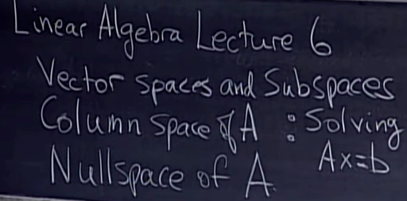
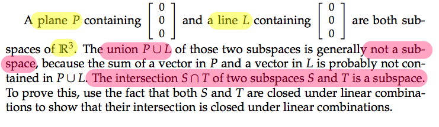
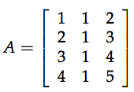
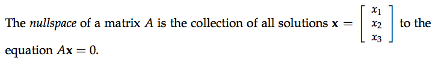
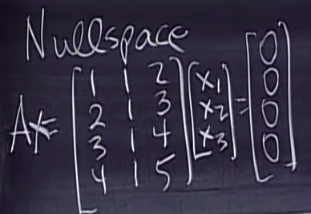

# MIT OCW 18.06 SC  Unit 1.6Column Space and Nullspace

Lecture timeline | Links
-- | --
Lecture | [0:00](https://www.youtube.com/watch?v=8o5Cmfpeo6g&index=6&list=PLE7DDD91010BC51F8&t=161s)
What are Vector spaces | [1:05](https://youtu.be/8o5Cmfpeo6g?t=1m5s)
Subspaces of R³ | [2:33](https://youtu.be/8o5Cmfpeo6g?t=2m31s)
Is the union of two subspaces a Subspace? | [4:23](https://youtu.be/8o5Cmfpeo6g?t=4m23s)
Column space | [11:36](https://youtu.be/8o5Cmfpeo6g?t=11m36s)
Features a Column space | [14:46](https://youtu.be/8o5Cmfpeo6g?t=14m46s)
How much smaller is the Column space? | [15:48](https://youtu.be/8o5Cmfpeo6g?t=15m48s)
Does every `Ax=B` have a solution for every `B`? | [16:17](https://youtu.be/8o5Cmfpeo6g?t=16m17s)
Which `B`s allow the system of equations solved | [19:39](https://youtu.be/8o5Cmfpeo6g?t=19m39s)
Null space | [28:12](https://youtu.be/8o5Cmfpeo6g?t=28m12s)
Understand what's the point of a Vector space | [40:24](https://youtu.be/8o5Cmfpeo6g?t=40m24s)

### Is the union of two subspaces a subspace?

### How to form a Column space
For a 3x3 matrix,

We pick out three Column Vectors, and take all their **`Linear combinations`**, then we formed a **`Column space`**.

> Definition: Column Space of A is all Linear combinations of A's columns.

### Does every 「Ax=B」 have a solution for every 「B」?

NO!
Not always, but sometimes.

> "The system of linear equations Ax = b is solvable exactly when b is a vector in the column space of A"

## Null space 「Ax=0」

> "If you give me a Matrix A, and let me to find N(A). Literally my goal is to find the set of All x's satisfied the equation Ax=0."

[Refer to Khan academy lecture](https://www.khanacademy.org/math/linear-algebra/vectors-and-spaces/null-column-space/v/introduction-to-the-null-space-of-a-matrix)
[Refer to this video explanation by TheTrevTutor](https://www.youtube.com/watch?v=JlC58uaJVsg&list=PLDDGPdw7e6AjJacaEe9awozSaOou-NIx_&index=32&t=0s)

