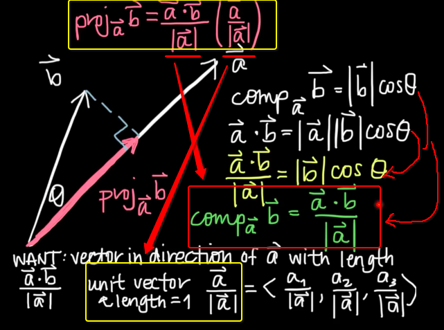
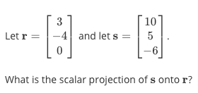
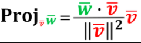
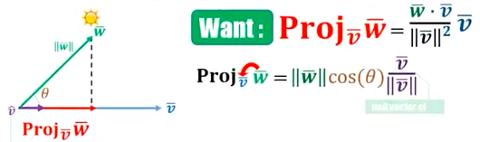
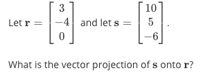

# ❖ 「Scalar Projection」 & 「Vector Projection」

[Refer to the note in `Pre Linear algebra` about understanding Dot product.](https://github.com/solomonxie/solomonxie.github.io/issues/48#issuecomment-383118452)

Assume that the vector `w` projects onto the vector `v`.
Notation:
- Scalar projection: **`Componentᵥw`**, read as "Component of `w` onto `v`".
- Vector projection: **`Projectionᵥw`**, read as "Projection of `w` onto `v`".

**Notice that: When you read it, it's in a reverse order! Very important!**

## Projection 「Formula」

Note that, the formula concerns of these concepts as **prerequisites**:
- Dot product calculation
- Dot product cosine formula
- Unit vector



## How to calculate the 「Scalar Projection」

> The name is just the same with the names mentioned above: `boosting`.

```py
Componentᵥw = (dot product of v & w) / (w's length)
```

[Refer to lecture by Imperial College London: Projection](https://www.youtube.com/watch?v=0bS5_k86id8&index=8&list=PLZnyIsit9AM7acLo1abCA1STjZ41ffwaM)
[Refer also to Khan academy: Intro to Projections](https://www.khanacademy.org/math/linear-algebra/matrix-transformations/lin-trans-examples/v/introduction-to-projections)

What if we know the vectors, and we want to know how much is the `Scalar projection`(the shadow)?
Example:

How we're gonna solve this is: We know the vectors, so we can get their `dot product` easily by taking their linear combination; and we know the length of each vector, by using Pythagorean theorem; and then we get the projection, as in the picture.

## How to calculate the 「Vector Projection」

> It's another idea for projection, and less intuitive.

Remember that a `Scalar projection` is the vector's **LENGTH** projected on another vector. And when we add the **DIRECTION** onto the LENGTH, it became a vector, which lies on another vector. Then it makes it a `Vector projection`.

It can be understood as this formula:
```py
Projectionᵥw = (Componentᵥw) * (Unit vector of v)
```
But usually we write it as this:





[Refer also to video for formula by Kate Penner: Vector Projection Equations](https://www.youtube.com/watch?v=cZuDWviSI4c)
[Refer to video by Firefly Lectures: Vector Projections - Example 1](https://www.youtube.com/watch?v=xSu-0xcRBo8)


Example:


