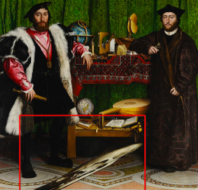
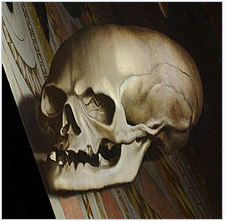
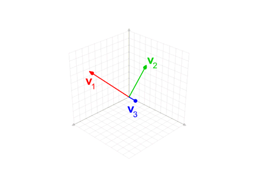

# ❖ Orthogonal Matrix

> It's a **Square Matrix** consisted with **Unit vectors**. Usually it's just **Identity Matrix**.

[Refer to Wiki: Orthogonal Matrix.](https://en.wikipedia.org/wiki/Orthogonal_matrix)
[Refer to lecture by Imperial College London: Orthogonal Matrices](https://www.coursera.org/learn/linear-algebra-machine-learning/lecture/uYJRz/orthogonal-matrices)

## 「Orthonormal basis」

> If two vectors are **Unit vectors** AND **Orthogonal**(perpendicular) to each other, they will be called `Orthonormal`.
If they form a set of Basis, they'll be called `Orthonormal basis`.

[Refer to Wiki: Orthonormality](https://en.wikipedia.org/wiki/Orthonormality)

## 「Transpose」 of Orthogonal matrix

If the Matrix composed with orthonormal basis, then its `transpose` is its `inverse`: 
```py
Aᵀ = A⁻¹

# which makes this one true as well
AAᵀ = 𝐈
AᵀA = 𝐈
```

### 「Determinant」 of Orthogonal matrix

The `determinant` of an Orthogonal matrix, **must be** either 1 or -1.
The -1 determinant means the matrix was flipped around from originally `right-handed` to `left-handed`.
```py
|A| = ±1
```

## The 「Gram–Schmidt process」

> " My life would probably be easier if I could construct some **orthonormal basis** somehow. And there's a process for doing that which is called the Gram-Schmidt process" - David Dye, Imperial College London

[Refer to Wiki: The Gram–Schmidt process](https://en.wikipedia.org/wiki/Gram%E2%80%93Schmidt_process)

How to see this process intuitively? 
Think about the famous paint [_The Ambassadors (Holbein) - Wikipedia_](https://en.wikipedia.org/wiki/The_Ambassadors_(Holbein))

The skull in the paint is so hard to recognize because it's in some "funny" basis, we need to transform it into our world basis, the `Orthonormal basis`, so that we could see it as below:



### How to 「Orthogonalize basis」

Refer to video by Trefor Bazett: 
[Using Gram-Schmidt to orthogonalize a basis](https://www.youtube.com/watch?v=LXE9NeaLQsc), 
[Full example: using Gram-Schmidt](https://www.youtube.com/watch?v=zti01DiImiQ&index=71&t=0s&list=PLHXZ9OQGMqxfUl0tcqPNTJsb7R6BqSLo6)
[The geometric view on orthogonal projections](https://www.youtube.com/watch?v=2dGXQwYDaqU&list=PLHXZ9OQGMqxfUl0tcqPNTJsb7R6BqSLo6&index=66)



