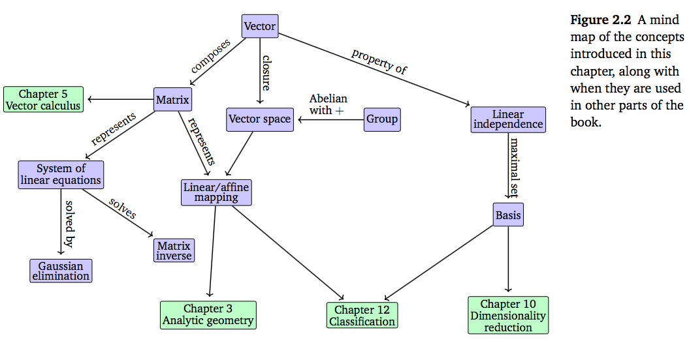
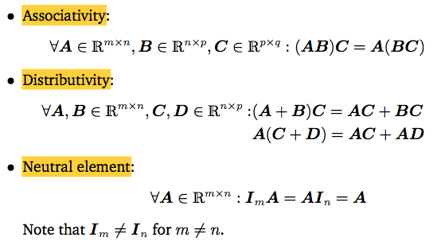

# Notes on Chapter 2 of Math for Machine learning

## Types of Vectors:

## Mathematical "closure":
- `Vector Space`: Use small set of vectors, to represent a "full closure" of all vectors I expect in an operation.
- `Matrix`: A collection of vectors.

## Mind map of some concepts:

## Properties for Matrix Multiplication:

## Analytic geometry

