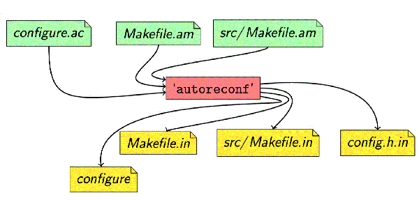

# ❖ Linux GNU Autotools 自动编译工具集 [DRAFT]

> 注意：Autotools 目前只对C/C++系的语言支持。

[参考：绝世秘籍之GNU构建系统与Autotool概念分析](https://www.linuxprobe.com/system-gnu-autotool.html)

`configure`脚本用来检测系统环境，最终目的是生成Makefile和config.h。
`make`命令通过读取`Makefile`文件，开始构建软件。
`make install`命令最后将软件安装到需要安装的位置。

`configure`文件和`Makefile`编译文件动不动就几千行代码，一般是不会手动写的。都是用GNU出品的`Autotools`完成。

这套`Autotools`的大概逻辑就是：只需要自己写`configure.ac`和`Makefile.am`两个文件就够了。

> "Make is the new Python!"

## Mac 安装Autotools
