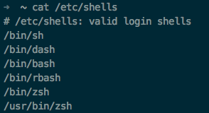

# 修改终端默认的shell


之前说过了，一般终端的默认Shell只要在终端应用如Terminal.app,iTerm2等的系统设置里直接改就好了。
但是如果我们要用ssh登录服务器就不能这么设置了，需要用到`chsh`这个命令。很简单
如果不懂的话，直接 `man chsh`就可以看到很简单的描述--改变登录shell。
首先要查到当前机器有哪些以安装的shell，`cat /etc/shells`。



我的默认有这些，可以看到zsh位于`/bin/zsh`，那么如果想要将zsh改为默认，就直接在终端里输入：
```
chsh -s /bin/zsh
```
即可达到修改默认终端的效果。如果是ssh连接服务器的话，需要重连才能看到效果。
