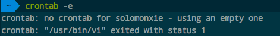

# ❖ Linux 定时任务 "crontab"

运行`crontab -e`后会自动跳进程序，在最底下一行写入执行命令，必须要按照格式写。
格式是`* * * * * 命令`，其中前五个星号分别代表着第几分钟、第几小时、每月第几日、哪个月、星期几。要按照顺序替换*为一个数字，如果保持*，则表示任意。
*还可以加运算符：
[参考文章](https://segmentfault.com/a/1190000007478002)

[在线Cron表达式生成工具。](http://xiongyingqi.com/cron-online/)

```
*:任何时间
/:每隔多久
-:连续时间
,:不连续的时间
```
[参考视频](https://www.youtube.com/watch?v=QZJ1drMQz1A)


```shell
# 每2分钟执行
*/2 * * * * echo "hello" >> ~/test.txt

# 每天执行
** 
```

## 动态修改Crontab
我们可以用Python或Shell脚本动态修改crontab：
```sh
# 先导出crontab设置
$ crontab > ./tasks.txt

# 输入新的crontab设置到文件中 (也可以直接修改txt文件)
$ echo '# some new command' >> ./tasks.txt

# 导入(覆盖)到crontab中
$ crontab jobs.txt
# OR
$ cat jobs.txt |crontab
```

## `Crontab创建任务时报错：crontab: no crontab - using an empty one crontab: "/usr/bin/vi" exited with status 1`


这个错误主要是没有在bash或zsh中指定文本编辑器的问题。
直接到`~/.bash_profile`或`~/.zshrc`文件中添加指定编辑器的语句即可：
```shell
export EDITOR=vim
```
退出后，重启Bash或者Zsh即可。
