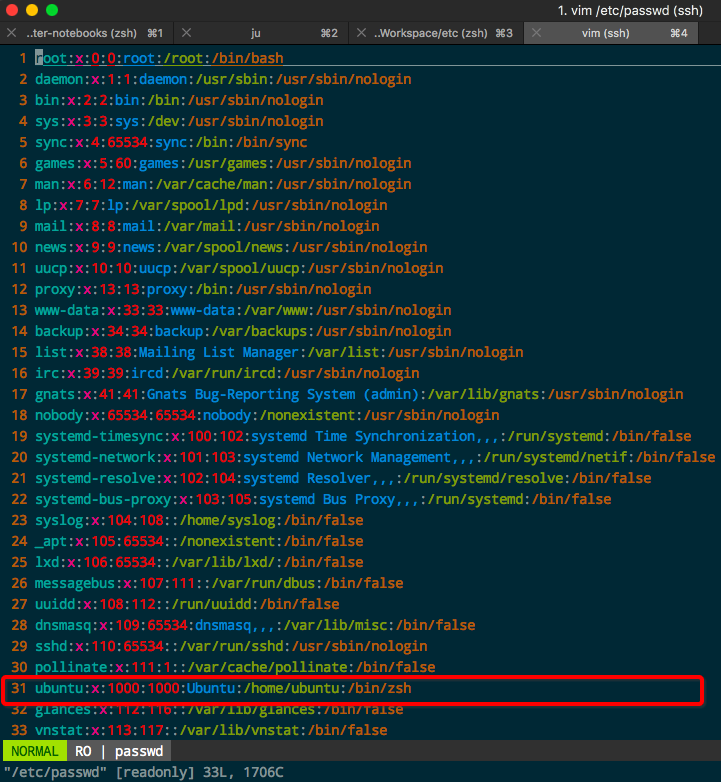

# Linux更改服务器的默认Shell
因为老登录服务器和树莓派什么的，默认bash实在太难看，tab补全也不好用，所以希望一连接就直接用zsh。
方法很简单：更改`/etc/passwd`这个文件。
看样子那个文件是保存密码似的，其实真不是，就一堆明文的各用户配置，其实也看不懂每行什么意思，如下：

因为是系统文件，所以需要root权限，这时用`sudo vim /etc/passwd`打开文件进行编辑，找到自己当前的用户名那一行，把最后的`/bin/bash`改成`/bin/zsh`即可。保存退出，重新登录连接服务器，哒哒！完成。

