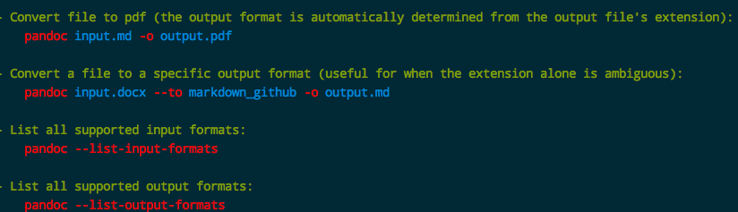
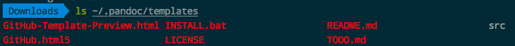

# Pandoc文件转化工具

[参考 Pandoc Demos](https://pandoc.org/demos.html)
[官方收集的各种模板： User contributed templates](https://github.com/jgm/pandoc/wiki/User-contributed-templates)



## 常用转换

```shell
# Markdown to Microsoft word .docx
$ pandoc FILENAME --to docx -o FILENAME.docx
```

## Markdown转HTML
一般来说，简单一句就够了：
```shell
$ pandoc in.md -o out.html
```

但是，页面丑爆了！所以我们必须加上模板来渲染出漂亮的页面，比如Github风格的markdown页面。
但是这就有一些些复杂了。

这里我们采用`GitHub Pandoc HTML5 Template`模板，地址在此：
https://github.com/tajmone/pandoc-goodies/tree/master/templates/html5/github

需要把这个目录中所有文件复制到`~/.pandoc/templates/`文件夹下:


如果本地没有这个文件夹，就自己创建一个。复制好之后，就可以直接引用名字来生成渲染过的markdown网页了:
```shell
$ pandoc --template=Github.html5 in.md -o out.html
```

