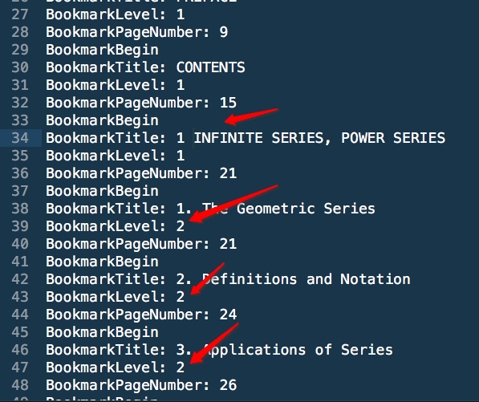

# ❖ Linux命令行对PDF分割合并的工具："pdftk"

`pdftk`是非常好用的PDF页面操作工具，能够切割、合并、提取指定页面等。

注意：`pdftk`在命令行中算中量级应用，70MB+。

[参考：PDF 合并和分割工具--PDFtk](https://blog.seisman.info/pdftk/)
[参考官网：PDFtk server:  the pdf tool kit](https://www.pdflabs.com/tools/pdftk-server/)

常用包括的功能如下：
- 合并 PDF；
- 分割 PDF 页面；
- 旋转 PDF 页面；
- PDF 带密码访问；
- PDF 填加密码；
- 用 X/FDF 填写 PDF 表格；
- 从 PDF 表格中生成 PDF Data Stencils；
- 加背景水印或前景印章；
- 报告 PDF Metrics，书签和元数据；
- 增加 / 更新 PDF 书签或元数据；
- 给 PDF 页面或文档加附件；
- 解压 PDF 附件；
- 分解 PDF 文档为多个单页；
- 解压缩和重压缩页面流；
- 修复受损的 PDF 文档；

## 安装
Linux上安装：
```sh
$ sudo apt-get install pdftk
```
Mac上安装：因为它对Homebrew支持还不算特别好，所以需要使用一键脚本安装：
```sh
$ brew install https://raw.githubusercontent.com/youtux/homebrew-binary/pdftk/pdftk.rb
```
如果不成功，则在官网下载pkg包，在桌面双击安装：
`https://www.pdflabs.com/tools/pdftk-the-pdf-toolkit/pdftk_server-2.02-mac_osx-10.6-setup.pkg`

目前我的测试中只有双击安装pkg包能成功。


## 常用命令

```sh
#提取1-15页为一个文件
$ pdftk input.pdf cat 1-15 output new.pdf

#提取第1至3，第5，第6至10页，并合并为一个pdf文件
$ pdftk input.pdf cat 1-3 5 6-10 output combined.pdf

#合并(concatenate) 前面所有的pdf为output.pdf
$ pdftk file1.pdf file2.pdf ... cat output new.pdf

#拆分PDF的每一页为一个新文件 并按照指定格式设定文件名
$ pdftk input.pdf burst output new_%d.pdf

#按照通配符，合并大量PDF文件
$ pdftk *.pdf cat output combined.pdf

#去除第 13 页,其余的保存为新PDF
$ pdftk in.pdf cat 1-12 14-end output out1.pdf

#扫描一本书，odd.pdf 为书的全部奇数页，even.pdf 为书的全部偶数页，下面的命令可以将两个 pdf 合并成页码正常的书
$ pdftk A=odd.pdf B=even.pdf shuffle A B output collated.pdf

#按180°旋转所有页面
$ pdftk input.pdf cat 1-endsouth output output.pdf

#按顺时针90°旋转第三页，其他页不变
$ pdftk input.pdf cat 1-2 3east 4-end output output.pdf

#输入密码转换成无密码PDF
pdftk secured.pdf input_pw foopass output unsecured.pdf

```

## 修改PDF的文件结构（目录）

大概流程是：
- 提取PDF的目录结构为一个txt文件
- 手动修改txt文件中的目录结构
- 将txt文件重新加载到PDF中并生成一个新文件

```sh
# 提取信息
$ pdftk sample.pdf dump_data output info.txt

# 修改信息
# ...

# 把更改的信息加载回PDF
$ pdftk sample.pdf update_info info.txt output sample2.pdf
```




## pdftk在Mac上运行卡住无反应

重新在mac上安装pdftk时，每次执行都会卡住不动，也不报错。
根据查询这篇回答：https://stackoverflow.com/questions/39750883/pdftk-hanging-on-macos-sierra
MacOS 10.12 Sierra上推荐安装`pdftk_server-2.02-mac_osx-10.11-setup.pkg`版本，即El Capitan (10.11)的版本。且这个版本支持高至MacOS 10.13。

官方下载地址为：https://www.pdflabs.com/tools/pdftk-the-pdf-toolkit/pdftk_server-2.02-mac_osx-10.11-setup.pkg


