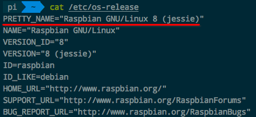
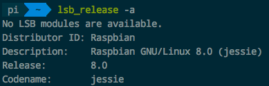
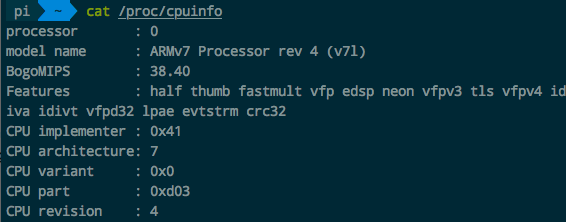
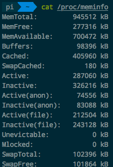
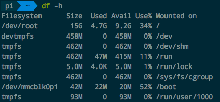

# ❖ Linux查看系统信息 [DRAFT]


## 查看系统版本

查看kernel内核：
```sh
$ cat /etc/os-release
```


查看版本Distribution（内置工具）：
```sh
$ cat /etc/*release # 查看所有版本相关（os-release, lsb-release)
$ cat /etc/lsb-release #查看发行版信息
>>> 
DISTRIB_ID=Ubuntu
DISTRIB_RELEASE=16.04
DISTRIB_CODENAME=xenial
DISTRIB_DESCRIPTION="Ubuntu 16.04.4 LTS"


$ cat /etc/issue* #查看包括/etc/issue和/etc/issue.net
>>>
Ubuntu 16.04.4 LTS \n \l
Ubuntu 16.04.4 LTS

$ cat /proc/version
>>> Linux version 4.4.0-1069-aws (buildd@lcy01-amd64-023) (gcc version 5.4.0 20160609 (Ubuntu 5.4.0-6ubuntu1~16.04.10) ) #79-Ubuntu SMP Mon Sep 24 15:01:41 UTC 2018
```

查看版本Distribution（第三方工具）：
```sh
$ lsb_release -a #显示全部
$ lsb_release -si #显示distribution
$ lsb_release -sd #显示distro描述
$ lsb_release -sr #显示distro的版本号数字
$ lsb_release -sc #显示distro的版本名称
```



## 查看CPU型号

```sh
$ cat /proc/cpuinfo
```



## 查看内存

```sh
$ cat /proc/meminfo
```



## 查看GPU

### 如果是Nvidia显卡
```sh
$ sudo apt-get install nvidia-smi
$ nvidia-smi -stats
```

## 查看存储

```sh
$ df -h
```


