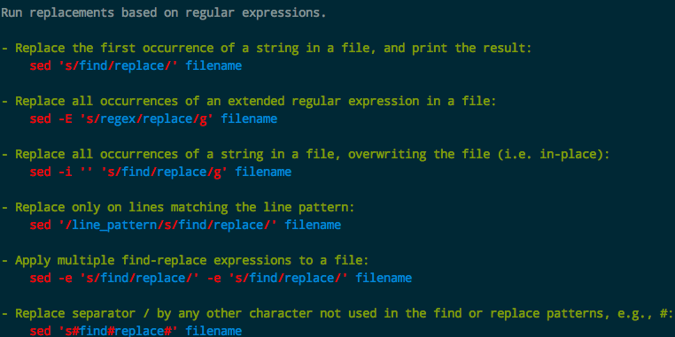
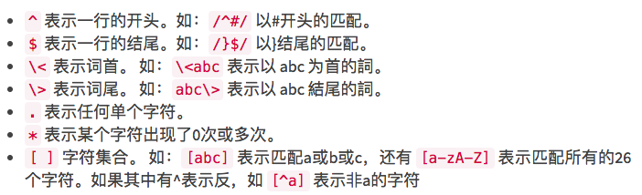

# ❖ sed 文本编辑命令一文入门

[参考极客学院：正则表达式和 SED](http://wiki.jikexueyuan.com/project/unix/regular-expressions.html)
[参考菜鸟教程：Linux sed命令](http://www.runoob.com/linux/linux-comm-sed.html)
[参考酷壳：SED 简明教程](https://coolshell.cn/articles/9104.html)

> sed匹配没有问题，但是默认会显示一行中所有内容，所以难的是你需要知道保存分组并且只显示你想要的分组。




基本语法：
```
sed [-n] [-e <expression>] [-f <外部脚本文件>] [被处理的文件]
```

参数说明：
```
-n或--quiet或--silent 仅显示expression处理后的结果
-e或--expression 可用来执行多个表达式：-e <expression1> -e <expression2>
-f<文件>或--file=<script文件> 读取外部文件里的脚本
```

动作命令说明：
```
a ：新增， a 的后面可以接字串，而这些字串会在新的一行出现(目前的下一行)
c ：取代， c 的后面可以接字串，这些字串可以取代 n1,n2 之间的行
d ：删除，d 后面不会加任何动作
i ：插入， i 的后面可以接字串，而这些字串会在新的一行出现(目前的上一行)
p ：打印，亦即将某个选择的数据印出。通常 p 会与参数 sed -n 一起运行
s ：替换，通常这个 s 的动作可以搭配正规表示. 例如 `1,20s/old/new/g`
```

支持的正则表达式：



## 以行号为单位操作

操作的格式：
- 单独行(Line Number)：`2`
- 区间(Range): `2,10`

按照**行号**执行命令：
- 删除(Delete)：`sed '<Range>d'`
- 增加：
    - 行前增加(Insert)：`sed '<Number>i <Text>'`
    - 行后增加(Append): `sed '<Number>a <Text>'`
- 更换(Change): `sed '<Range>c <Text>'`


## 以文字匹配为单位操作

操作格式：
```sh
sed /<RegX>/<Action>
```

按照**搜索结果**执行命令：
- 匹配并显示整行：`sed '/<RegX>/p'`
- 匹配并执行命令：`sed -n '/<RegX>/{<CMD>;p;q}'`
- 匹配并删除整行：`sed '/<RegX>/d`
- 匹配并替换匹配项：`sed 's/<RegX>/<Text>/g'` 和VIM的匹配替换命令一样


## 文字匹配加行号匹配执行操作

结尾命令(Action):
- 全局替换：`g`
- 出现次序替换：`<Index>`，如`1`代表匹配只第一个结果，`2`是第二个结果


操作格式：
```sh
sed '<Range>s/<RegX>/<Text>/<CMD>' <File>
```

组合文字和行号匹配执行命令：
- 替换指定行的内容：`sed '<Range>s/my/your/g'`

## sed直接修改文件

- 在最后一行尾添加文字：`sed -i 's/$/<Text>/g' test.txt`


## 多次匹配

```sh
sed '<expression1>; <expression2>'
# 或
sed -e '<expression1>' -e '<expression2>'
```


## 正则表达式的变量

用`&`代表匹配到的文字：
```sh
sed 's/<RegX>/Before & After/g' <file>
```

用`( )`创建分组，并用`\n`代表匹配到的文字：
```sh
sed 's/(Reg1)(Reg2)/\1\2/g'
```


## 常用

假设我们用`ping -c 10 localhost >> ping.txt`文件，然后用sed来操作：

```
# 只显示第1行
$ cat ping.txt | sed -n '1p'
# 只显示最后一行(这个无需sed)
$ tail ping.txt -n 1

# 只显示第2-4行
$ cat ping.txt | sed -n '2,4p'

# 删除第2-4行并显示
$ cat ping.txt | sed '2,4d'

# 显示本机在局域网内IP地址
$ /sbin/ifconfig eth0 | grep 'inet addr' | sed 's/^.*addr://g' | sed 's/Bcast.*$//g'
>>> 192.168.1.100 Bcast:192.168.1.255 Mask:255.255.255.0
```

