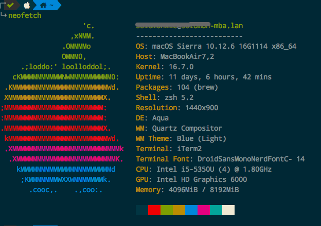
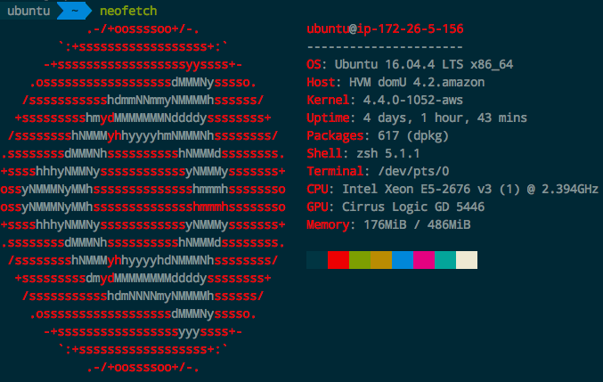
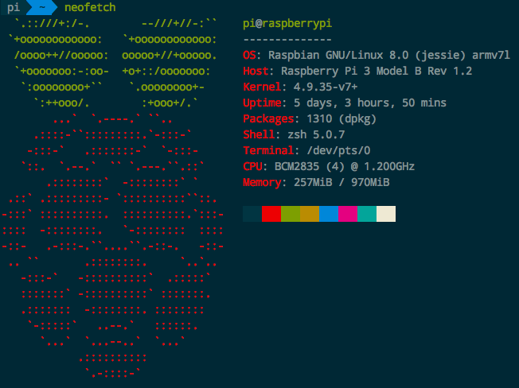

# Neofetch 超帅终端显示系统信息

> Neofetch主要是用来炫桌面的、截图用的。

[Refer to: neofetch – Awesome system info bash script for Linux, MacOS, Unix](https://www.cyberciti.biz/howto/neofetch-awesome-system-info-bash-script-for-linux-unix-macos/)


支持多种OS：Linux/Mac

Mac安装：
```sh
$ brew install neofetch
```



Ubuntu安装：
```sh
sudo add-apt-repository ppa:dawidd0811/neofetch

sudo apt update && sudo apt install neofetch
```



树莓派安装(Jessie版)：
```sh
sudo echo "deb [arch=all] http://dl.bintray.com/dawidd6/neofetch jessie main" > /etc/apt/sources.list.d/neofetch.list

sudo apt update && sudo apt install neofetch
```



很快安装好后，只要输入`neofetch`命令，就会马上显示出漂亮的信息。


