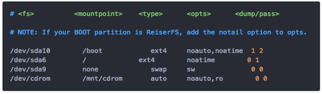

# fstab与mount挂载外部磁盘详解

在`/etc/fstab`文件中，每一行都是一个Entry Point “入口”，每一条入口的格式为：
```
File_system   Mount_point   Type  Options   Dump/Pass
```


[参考：配置启动挂载：fstab文件详解](https://www.jianshu.com/p/87bef8c24c15)

1. `File_system` 即设备ID或设备位置，如`/dev/sdax`
2. `Mount_point` 挂载点（文件夹地址）
3. `Type` 格式类型，如fat32,ntfs, ntfs-3g,ext2,ext4
**4. `Options` 加载参数：最重要的命令！**
5. `Dump` 备份命令：用来决定是否做备份的.  值为0或1。如果是0，dump就会忽略这个文件系统，如果是1，dump就会作一个备份。大部分用户都没有安装`dump utility`，所以对他们而言这里都写0。
6. `Pass` 启动时是否以fsck检验扇区。值为0或1。0 是不要检验(swap等不需要)， 1 表示最早检验(一般只有根目录会配置为 1)； 2 也是要检验，不过是在重要目录检验之后才执行！一般来说,根目录配置为1，其他的要检验的filesystem都配置为 2 就好了。

**其中，最重要的设置就是`Options`！**

它会设置设备的读写权限、开机自动加载、中文显示乱码问题等。它的内容是与mount命令的`-o`选项内容是一样的。

> Option中可以有很多参数值，每个值之间用`,`逗号隔开。

Options 常用参数：
- `defaults` 使用默认设置。等于rw,suid,dev,exec,auto,nouser,async，具体含义看下面的解释。
- `自动与手动挂载`:
- `auto／noauto`：是否在启动或在终端中输入mount -a时自动挂载
- `ro / rw`* 只读或读写权限
- `umask`*：非常重要，指定三级读写权限：如777，022等。这样就分别指定了当前用户、组、other的读写权限。
- `exec／noexec` 默认为exec，可执行分区中的二进制文件。noexec不允许执行二进制文件。千万不要在你的root分区中用这个选项！！！
- `sync／async`，所有的I/O以Sync方式运行，还是以异步Async方式运行。
- `user／nouser` ：user允许任何用户挂载设备，代表了noexec,nosuid,nodev unless overridden。nouser为默认设置，只允许root挂载。
- 临时文件执行权限：
    - `suid` Permit the operation of suid, and sgid bits. They are mostly used to allow users on a computer system to execute binary executables with temporarily elevated privileges in order to perform a specific task.
    - `nosuid` Blocks the operation of suid, and sgid bits.
- `noatime` 关闭atime特性，提高性能，这是一个很老的特性，放心关闭，还能减少loadcycle


## fstab详细参考
```
you will see this in the file and you need to add your new entry under this line.

brief explanation of the above format:

1.file_system = your device id.

use this:

/dev/sdax ( you should check it with sudo fdisk -l)

it may be /dev/sdbx or /dev/sdcx if you have more than one disks connected.

2. mount_point =where you want to mount your partition.

use this:

/media/user/label  

here user is your user name, label is "software", "movies" or whatever label your partiton have.

3. type=fat32,ntfs, ntfs-3g,ext2,ext4 or whatever your partition type is.

4. options =mount options for the partition(explained later).

5. dump=Enable or disable backing up of the device/partition .usually set to 0, which disables it.

6. pass =Controls the order in which fsck checks the device/partition for errors at boot time. The root device should be 1. Other partitions should be 2, or 0 to disable checking.

so for auto mounting case the above format reduces to:

/dev/sdax /media/user/label  type  options           0  0

(you can check the type with sudo fdisk -l)

the options field:

sync/async - All I/O to the file system should be done synchronously/asynchronously.
auto/noauto - The filesystem will be mounted automatically at startup/The filesystem will NOT be automatically mounted at startup.
dev/nodev - Interpret/Do not interpret character or block special devices on the file system.
exec / noexec - Permit/Prevent the execution of binaries from the filesystem.
suid/nosuid - Permit/Block the operation of suid, and sgid bits.
ro/rw - Mount read-only/Mount read-write.
user/nouser - Permit any user to mount the filesystem. (This automatically implies noexec, nosuid,nodev unless overridden) / Only permit root to mount the filesystem. This is also a default setting.
defaults - Use default settings. Equivalent to rw, suid, dev, exec, auto, nouser, async.
_netdev - this is a network device, mount it after bringing up the network. Only valid with fstype nfs.
now the final format reduces to (for auto mount):

/dev/sdax /media/user/label  type     defaults       0  0  

for ntfs

/dev/sdax /media/user/label   ntfs  defaults       0  0  

for ext4

/dev/sdax /media/user/label   ext4  defaults       0  0  

etc.....

you can change defaults by your own configuration, like

/dev/sdax /media/user/label   ext4  rw,suid,dev,noexec,auto,user,async      0  0

etc...

you need to add entry for each partiton you want to auto mount.

3. save and exit the file then restart and see the result.
```
