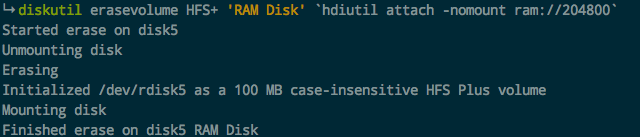
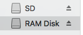
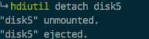
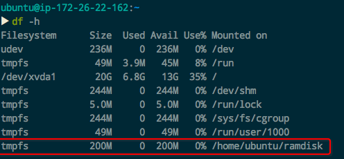

# ❖ Linux/Mac 创建Ram Disk内存盘

把内存空间转换为本地使用的硬盘，加速文件读取。适用于处理高并发任务。

如果只是作为临时缓存的话，连数据库存储也可以放到Ram Disk中进行。（但是如果自己手动这样操作，还不如直接用Redis）

所以，参考Redis，内存盘在开发中还有各种的可能性可以供你去创造。


## Mac创建Ram Disk

[参考：How to Create a 4GB/s RAM Disk in Mac OS X](https://www.tekrevue.com/tip/how-to-create-a-4gbs-ram-disk-in-mac-os-x/)

Mac上，需要用到`diskutil`命令和`hdiutil`命令，这个都是默认有的不需要安装：
```sh
$ diskutil erasevolume HFS+ 'RAM Disk' `hdiutil attach -nomount ram://204800`
```

其中`ram://00000`是代表分配的内存大小，以byte为单位。2048byte为1MB。



安装完后就会看到文件夹中多出一个磁盘：


尝试拷贝个文件后发现：100MB的文件拷贝进去只是一瞬间，连进度条都没有出现！

删除内存盘：
先用`df -h`找到磁盘的所在位置，比如我的是`/dev/disk5`，
然后卸除挂载需执行：
```sh
hdiutil detach disk5
```


如果报busy，那么就用各种方法关闭相关的文件夹、终端shell等，再来执行。


## Ubuntu创建Ram Disk

[参考：How to use a ramdisk on Linux](https://www.techrepublic.com/article/how-to-use-a-ramdisk-on-linux/)

```sh
mkdir ~/ramdisk

# 分配／挂载内存盘
sudo mount -t tmpfs -o size=200M tmpfs ~/ramdisk

# 卸载／删除内存盘
sudo umount ~/ramdisk
```

其中`tmpfs`是内存，我们随便创建了一个文件夹就可以挂载上去。

可以看到，我们从内存中分了200MB出来作为本地磁盘使用：


Linux分配内存盘实在太方便了。

## 开机自动挂载Ram Disk

直接修改`/etc/fstab`文件，加入以下：
```
none /home/ubuntu/ramdisk tmpfs nodev,nosuid,noexec,nodiratime,size=200M 0 0
```

## 定期备份内存盘

直接在`crontab`里面添加`*/15 * * * * cp -ru /home/ubuntu/ramdisk /home/ubuntu/backup`
