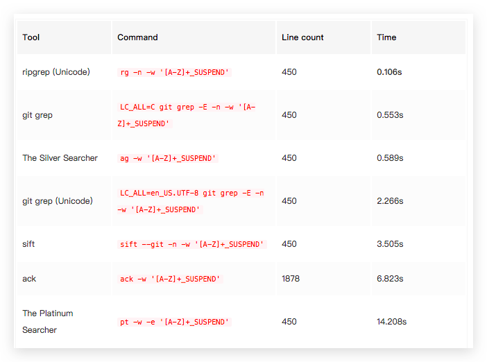
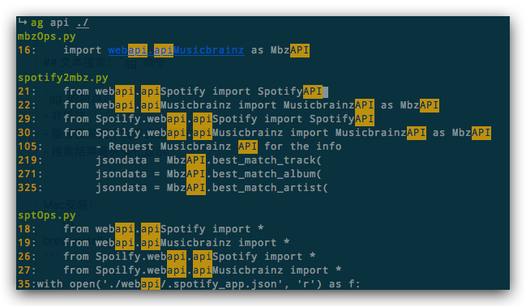

# ❖ Linux 搜索工具 [DRAFT]

## 文件搜索程序候选列表
- find
- fd: 实现find的80%功能，速度更快，增加忽略文件功能


Mac安装：
```sh
brew install fd
```

Ubuntu安装：
```sh
sudo apt-get install fd-find
```


## 文本搜索候选列表

- grep
- sed
- awk
- ack
- ag: The Silver Searcher. 比ack快
- rg: RipGrep. 搜索代码和ag同速，比ack快3-5倍
- sift
- ucg
- pt

测试——在整个Linux内核源码中执行搜索效率：




## 文件搜索：`fd`命令

`fd`能实现find的80%功能，速度更快，增加忽略文件功能

Mac安装：
```sh
brew install fd
```

Ubuntu安装：
```sh
sudo apt-get install fd-find
```

常用命令：
```sh
- Find files matching the given pattern in the current directory:
    fd pattern

- Find files that begin with "foo":
    fd '^foo'

- Find files with a specific extension:
    fd --extension txt

- Find files in a specific directory:
    fd pattern path/to/dir

- Include ignored and hidden files in the search:
    fd --hidden --no-ignore pattern
```


## 文本搜索：`ag`命令

`ag`的特点：
- 非常快
- 能够搜索整个文件夹的所有文件
- 搜索结果高亮美化显示


Mac安装：
```sh
brew install ag
```

常用命令：
```sh
- Find files containing "foo", and print the line matches in context:
    ag foo

- Find files containing "foo" in a specific directory:
    ag foo path/to/folder

- Find files containing "foo", but only list the filenames:
    ag -l foo

- Find files containing "FOO" case-insensitively, and print only the match, rather than the whole line:
    ag -i -o FOO

- Find "foo" in files with a name matching "bar":
    ag foo -G bar

- Find files whose contents match a regular expression:
    ag '^ba(r|z)$'

- Find files with a name matching "foo":
    ag -g foo 
```

简单一句`ag 关键字 ./`就搜索当前文件夹，看一下搜索效果：



