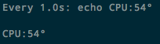

# Linux 查看CPU温度

每种设备查看温度的方式都不同。

## 树莓派

无需安装工具即可查看：
```sh
cat /sys/class/thermal/thermal_zone0/temp
>>> 62838

# 或者直接以度为单位显示
echo $[$(cat /sys/class/thermal/thermal_zone0/temp)/1000]°
>>> 63
```
显示数字为千分之一度。所以说，除以1000就是当前温度值。

可以设置watch实时观看：
```sh
watch -n 0.1 echo CPU: $[$(cat /sys/class/thermal/thermal_zone0/temp)/1000]°
```




### PC


直接查看：
```sh
# 查看第一个核心
$ cat /proc/acpi/thermal_zone/TZS0/temperature

# 查看第二个核心
$ cat /proc/acpi/thermal_zone/TZS1/temperature
```

### lm_sensors

Ubuntu:
```sh
# 安装
sudo apt-get install lm-sensors -y
yes | sudo sensors-detect
# 运行
sensors
```


